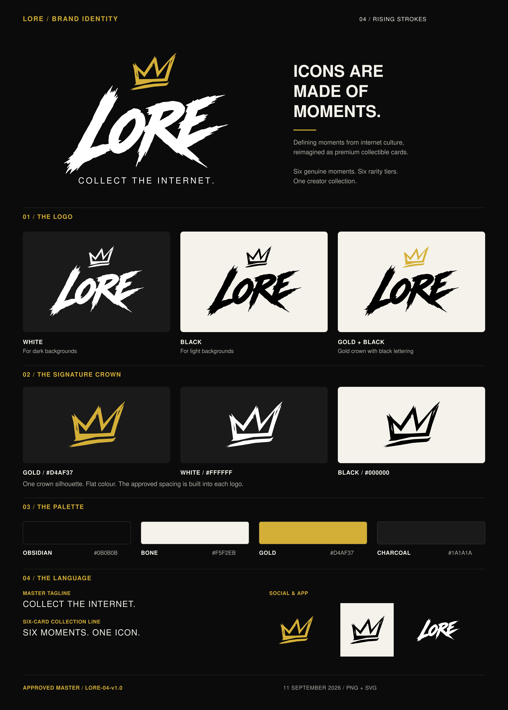

# LORE

**COLLECT THE INTERNET.**

**Brand locked: 04 / Rising Strokes.** [Branding page](brand/README.md) · [PNG + SVG pack](brand/downloads/LORE-Brand-Pack-v1.0.zip) · [Individual assets](brand/assets/README.md)

LORE is a premium creator-collectible brand that turns defining moments from internet culture into physical and digital collectible cards.

## Locked brand language

- **Master tagline:** COLLECT THE INTERNET.
- **Brand thought:** ICONS ARE MADE OF MOMENTS.
- **Six-card collection line:** SIX MOMENTS. ONE ICON.

## Core product idea

Each featured creator receives a six-card collection built from six genuine, researched moments from their public history. Each card reimagines one real moment as premium anime/manga-inspired collectible art.

The six rarity tiers are:

1. Common
2. Uncommon
3. Rare
4. Epic
5. Legendary
6. Mythic

Rarity changes scarcity, finish, presentation and collectability — not the importance or factual significance of the underlying moment.

## Product ecosystem

- Physical collectible cards
- Secure digital claiming
- Collector Vault
- Creator profile and partner dashboards
- Card population and serial tracking
- Creator and collector leaderboards
- Shareable social collection moments
- Official six-card creator display frames
- QR links back to the original post, video, stream or source moment

## Selected card front reference

The Asmongold v3 set is the selected reference for the front QR layout, illustration style and headroom. Use the [front design standard](cards/07-FRONT-LAYOUT-AND-ART-MASTER.md), [reusable master templates](cards/master/front-v3/README.md) and [design lock](cards/card-design-lock.json) for future creator cards.

The [shared LORE back](cards/review/shared-back-v3/README.md) is a proposal awaiting review. Physical print approval and live QR routes remain pending.

## Source of truth

This repository is the canonical source for LORE branding, card standards, creator research, physical-product rules and digital-product direction.

Do not rely on chat memory or old mockups when they conflict with a locked document in this repository.
