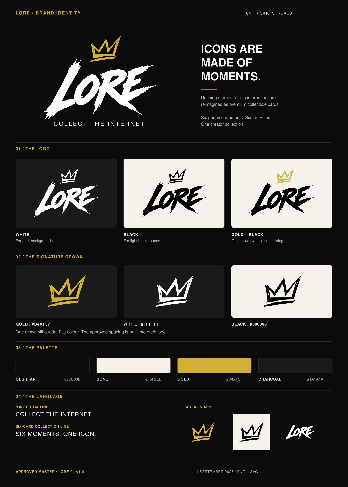

# 050 The Pineapple Fund published and digitally verified — 8 October 2026

The approved First Clear Water artwork and exact master-default card framing are preserved. BITCOIN / PINEAPPLE FUND / Common / 2018 / WEALTH INTO WATER. / 050/100. The caption is original editorial wording. Source artwork SHA-256: `816fe9705bd6812b84d9ace829ebb91067922f8106818d70b3f74eb329143192`. Current master: `cards/crypto/season-01/the-pineapple-fund-master-050`.

Stable QR: https://lore-site-v1.vercel.app/crypto/050/ → `/cards/the-pineapple-fund`. Card, two-page A4 book and website share five story paragraphs, two primary sources and four exact-art clues: the PINE plaque, water test kit, Bitcoin case and later impact notebook. The campaign began in late 2017 and continued in 2018. The Water Project’s US$1 million Bitcoin gift and later 37-project account are distinguished from the campaign year; the notebook’s 2019 date marks later context. People, village and plaque are fictional representative imagery. No charity endorsement is implied.

Publication checks cover 50 numbered cards, 52 unique approved designs including two archived unnumbered designs, 212 clues, 100 book previews, 568 packed display assets and 120 related-story links. All 51 prior registry objects and 560 prior display assets are retained. HODL hero, CryptoKitties discovery, dynamic shop count, narrow clue-grid correction and the four-reference art-style pack remain unchanged.

Content release `407c4183d0e58450185154efe2b4579d7b5d5fb7` is verified on GitHub main and production deployment `dpl_6ySre39VDMQJBTQ9dssjVKFZsshs` is READY. All 50 live QR routes, eight new display hashes, six original-download hashes, embedded artwork pixels and PNG/PDF/web-card QR decoding pass. Browser coverage and limits are recorded in the master’s publication-verification.json. Original downloads are pinned to asset commit `931591f44424bb70c5ed996901aac9ff6065b7da`. Native book art remains 128.21 effective PPI in the unchanged A4 layout, with resolution review deferred to the final collection review. Physical printer/sample acceptance, camera QR tests and rights clearance remain separate and are not claimed.

---

# Previous publication: 049 Uniswap Launches

The approved 049 card and two-page book are published with LIQUIDITY, PAIRED. and exact v9 art. See [current status](CURRENT-STATUS.md) and [049 technical records](cards/crypto/season-01/uniswap-launches-master-049/README.md). Stable story route: https://lore-site-v1.vercel.app/crypto/049/. Verified counts: 49 numbered cards, 208 clues and 98 book previews. Live verification is recorded separately in the card master.

---

# HISTROVE — current brand and printer files

The current identity is HISTROVE / History Worth Holding. [Approved printer files](cards/crypto/print-ready/histrove-v1) · [Future templates](cards/crypto/master/histrove-print-v1) · [Brand pack](brand) · [Historical LORE brand](archive/brand) · [Historical print archive](archive/print). Physical printer/sample acceptance remains separate. Website content and branding are not changed by this repository release.

## Current Crypto art reference pack

[Four approved raw-art references](cards/crypto/ART-STYLE.md) · [Pinned paths and hashes](cards/crypto/style-reference-lock.json)

HODL 021 and Birth of Doge 020 remain joined by CryptoPunks 038 and CryptoKitties 046 for all new Crypto Season One cards and artwork edits. The current pack governs whole-scene drawing treatment; Creator references, approved art, card framing and rights status are unchanged.

## Historical project introduction

# 038 and 039 published and verified

CryptoPunks (038) and Behind the Chair (039) complete the published 001–039 collection: 168 clues, 78 book previews and 324 display images. Content release b16e2f5440f8e34bf449119ae2d14c10b268c7c7 passed all 39 live QR routes, 17 new media hashes, 12 original downloads, digital QR decoding, exact book/site copy and independent desktop browser checks. All earlier sources/media are preserved. Narrow visual-browser testing was unavailable; physical/device reproduction remains separate. Original downloads are pinned to 22f32e165862020b5ec5bbd837f65e58e3b72364.

# LORE

**COLLECT THE INTERNET.**

**Brand locked: 04 / Rising Strokes.** [Branding page](brand/README.md) · [PNG + SVG pack](brand/downloads/LORE-Brand-Pack-v1.0.zip) · [Individual assets](brand/assets/README.md)

LORE is a premium internet-culture collectible brand that turns defining moments from internet culture into physical and digital collectible cards.

## Locked brand language

- **Master tagline:** COLLECT THE INTERNET.
- **Brand thought:** ICONS ARE MADE OF MOMENTS.
- **Six-card collection line:** SIX MOMENTS. ONE ICON.

## Core product idea

**Season One: Crypto. Season Two: Gaming Creators (planned).**
[Crypto rules and current cards](cards/crypto/README.md) include the approved
[Pizza Day Legendary](cards/crypto/season-01/pizza-day-master-01/README.md).
Crypto assigns one rarity per event, with standard and foil finishes at every
tier. Event dates replace creator moment counters. Set size and quantities
remain undecided. This extension preserves LORE's existing layout and anime style.

Each featured creator receives a six-card collection built from six genuine, researched moments from their public history. Each card reimagines one real moment as premium anime/manga-inspired collectible art.

The six rarity tiers are:

1. Common
2. Uncommon
3. Rare
4. Epic
5. Legendary
6. Mythic

Rarity changes scarcity and collectability; crypto foil is a separate finish available at every tier — not the importance or factual significance of the underlying moment.

## Product ecosystem

- Physical collectible cards
- Secure digital claiming
- Collector Vault
- Creator profile and partner dashboards
- Card population and serial tracking
- Creator and collector leaderboards
- Shareable social collection moments
- Official six-card creator display frames
- QR links back to the original post, video, stream or source moment

## Locked card design

The Asmongold v3 set is the selected reference for the front QR layout, illustration style and headroom. Use the [front design standard](cards/07-FRONT-LAYOUT-AND-ART-MASTER.md), [reusable master templates](cards/master/front-v4/README.md) and [design lock](cards/card-design-lock.json) for future creator cards.

**LORE-CARD-v1.1 is visually locked:** the selected v3 fronts with the approved v4 badge spacing and the approved [shared LORE back v5](cards/08-SHARED-BACK-MASTER.md). The back has no diamond, a thicker gold outer border and a clearer thin inner border. [Download its PNG and SVG](cards/master/shared-back-v5/README.md). **Finished card size is locked at [63 × 88 mm](cards/09-PHYSICAL-SIZE-STANDARD.md)**, the standard Pokémon/Magic TCG format. Printer-specific bleed, physical print approval and live QR routes remain pending.

## Source of truth

**Historical creator artwork selection:** [Asmongold — The $2 Steak](cards/creators/asmongold/steak-master-01/README.md). The first card is visually signed off as v2 with `I’M A SIMPLE MAN.` beneath the title. See the [moment phrase standard](cards/11-MOMENT-PHRASE-STANDARD.md). Use the [illustration consistency standard](cards/10-ILLUSTRATION-CONSISTENCY.md) and [project memory](PROJECT-MEMORY.md) to preserve the selected style across future cards.

This repository is the canonical source for LORE branding, card standards, creator research, physical-product rules and digital-product direction.

Do not rely on chat memory or old mockups when they conflict with a locked document in this repository.
