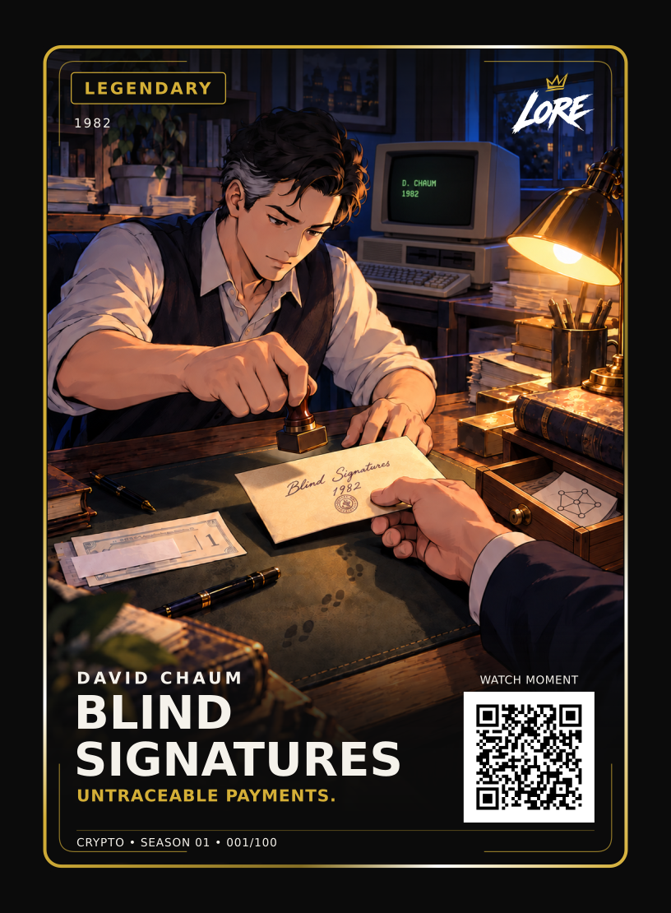

# 001 — Blind Signatures

**Crypto · Season One · Legendary · 1982**

**On the card:** UNTRACEABLE PAYMENTS.

## The story

Imagine taking a letter to someone whose signature you need. You want them to confirm it is valid, but you do not want them to read what is inside. In LORE’s illustration, the envelope stays closed as the stamp lifts away. That small gap between the signer and the hidden message is the idea behind a blind signature.

In 1982, David Chaum presented *Blind Signatures for Untraceable Payments*. A conventional signature shows that a signer approved a message. Chaum’s method added a twist: the requester disguises the message first, the signer signs the disguised version, and the requester removes the disguise. The result can still be verified against the original message. The signer did not see that message at signing time.

Chaum applied the idea to electronic payments. A bank could sign a digital payment token when a customer withdrew it, then recognise a valid token when it was spent. Because the bank had signed a blinded version, it could not simply match that later token to the particular token it saw at withdrawal. That is the privacy promise captured by the card’s line, **UNTRACEABLE PAYMENTS.** It is a design goal of the proposed scheme, not a claim that every later electronic payment or every surrounding detail is anonymous.

The card freezes the instant after the seal is made. The signer has authenticated something concealed; the envelope can now travel. In a story about digital money, an old-fashioned object makes an abstract cryptographic move visible.

## Hidden in the artwork

1. **The fresh seal.** The raised stamper and its shadow show that the mark has just been made. The envelope stands for a message authenticated without being read.
2. **The concealed slip.** A partly hidden payment slip points to the payment application. A bank can know who withdrew value while the later spend need not reveal which withdrawal produced it.
3. **The fading footprints.** The trail breaks across the desk: a visual metaphor for the intended break in the transaction link. Other information can still compromise privacy.
4. **The drawer diagram.** The small node sketch is a forward reference to the 2008 Bitcoin whitepaper. It is a deliberate LORE crossover, not a real prop from 1982.

## Source and art note

Chaum lists the paper as presented at CRYPTO 1982. The approved card uses **1982** because the selected event record has year precision. Read the [original paper](https://chaum.com/wp-content/uploads/2022/01/Chaum-blind-signatures.pdf) and [Chaum’s publication list](https://chaum.com/publications/). The room, computer, envelope, stamper, drawer and characters are illustrative; this is not a reconstruction of Chaum’s workspace or a photograph of the event.

**Editorial status:** Chapter draft and [two-page A4 layout study](proofs/001-blind-signatures-spread-v1.pdf), 26 September 2026. The card front, art, phrase, rarity and number are approved. Book wording, trim size and page design have not received separate approval. The QR works in the current digital scan; physical print proof remains separate.
