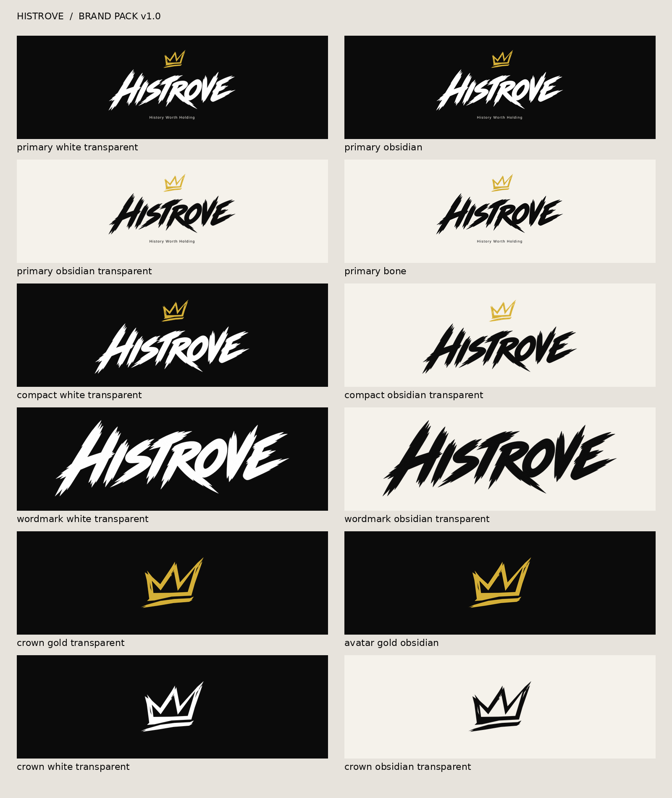

# HISTROVE

**History Worth Holding**

The current identity is the approved HISTROVE brush wordmark with the exact **04 / Rising Strokes** gold crown. Approved 6 October 2026. This pack supersedes the old LORE identity pack; all original files are retained in [the archive](../archive/brand/LORE-04-v1.0/).

[Download the brand pack](downloads/HISTROVE-Brand-Pack-v1.0.zip) · [Browse PNGs](assets/png/) · [Asset register](assets/asset-manifest.json)

## Crypto illustration reference pack

[View the four approved raw-art references](../cards/crypto/ART-STYLE.md) · [Exact paths and hashes](../cards/crypto/style-reference-lock.json)

HODL 021, Birth of Doge 020, CryptoPunks 038 and CryptoKitties 046 guide all new Crypto Season One art and artwork edits. Compare mature anime coherence, cinematic lighting, controlled texture and background perspective. Use raw art rather than card frames; do not import unrelated characters, logos or motifs. Reference selection does not confer rights clearance. Creator artwork references stay separate. This linked illustration pack does not change the identity-export ZIP above.

## Choose a file

- Dark surfaces: `histrove_primary_white_transparent-2400.png`
- Ready-made dark panel: `histrove_primary_obsidian-2400.png`
- Light surfaces: `histrove_primary_obsidian_transparent-2400.png`
- Ready-made Bone panel: `histrove_primary_bone-2400.png`
- Small placements: `histrove_compact_white_transparent-2400.png` (or Obsidian lettering on light)
- Lettering alone: `histrove_wordmark_white_transparent-2400.png` (or Obsidian)
- Symbol: gold, white or Obsidian transparent crown, 2048 × 2048
- Social profile: `histrove_avatar_gold_obsidian-1024.png`

All filenames above are in `assets/png/`. Wordmark-containing PNGs have both 2400px and 1200px widths. Primary: 2400 × 1440; compact: 2400 × 1180; wordmark: 2400 × 780. Transparent variants have genuine alpha, not a checkerboard baked into the file. Panel and avatar variants intentionally include backgrounds.

## Quality and limits

The approved brush lettering is a **2172 × 724 raster**, placed at 2080 × 693.33 units in the 2400px-wide primary lockup. The 2400px exports do not upscale that source. Do not confuse canvas width with lettering detail. The original 3000 × 1800 approval proof is preserved for reference; its larger canvas does not add brush detail.

SVG files are convenient assemblies with the original vector crown, outlined tagline and **embedded raster lettering**. They are not a fully vector or infinitely scalable wordmark. Crown-only SVGs are genuinely vector. No letter or crown has been regenerated or retraced. For significantly larger print applications, obtain approval of a separately prepared vector brush master or test this source at final size. Printing a 2400px canvas at 300ppi gives an 8-inch-wide panel; that is an output-size calculation, not printer acceptance.

Palette: Obsidian `#0B0B0B`, Bone `#F5F2EB`, Gold `#D4AF37`, White `#FFFFFF`, Charcoal `#1A1A1A`. Gold is flat RGB, not a foil or CMYK instruction. Use dark lettering on light backgrounds; the gold crown on Bone is decorative and should not carry essential small text.

## Consistency

Scale complete assets uniformly. Preserve the approved crown-to-wordmark placement and built-in padding. Do not replace the lettering with a font, redraw the crown, distort, add bevels/shadows, or generate a new logo inside card illustrations. Add the supplied identity as a separate layer. Full lockups use the approved tagline spelling and case: **History Worth Holding**.

The old marketing lines are historical references, not substitutes for the current primary tagline. Existing collection rules, approved art and card wording are not changed by this brand pack. Website migration is outside this pack's scope.

## Sources and verification

[Brand lock](brand-lock.json) · [Approval](source/approval.json) · [Primary assembly](source/approved-primary.svg) · [Components](source/master-components.json) · [Technical QA](qa/technical-qa.json)

Technical QA and visual identity approval are separate from trademark clearance and physical printer/sample approval. No trademark or manufacturing clearance is claimed.

## Rebuild

Use Python 3, Pillow and Inkscape. Run `python brand/scripts/build_assets.py` from the repository root, then inspect the PNGs on light/dark surfaces and record visual QA before packaging. The source approval proof remains unchanged; the assembly's tagline is outlined for font-independent exports.
