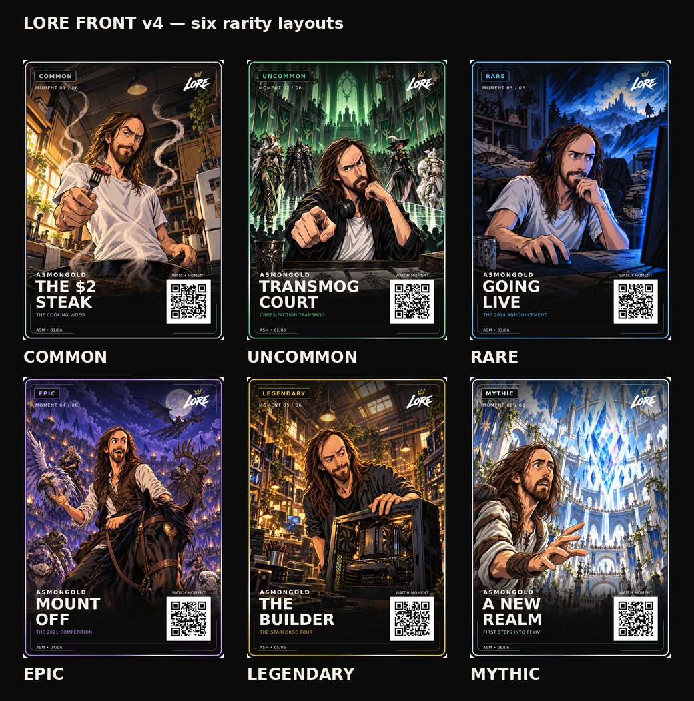

# LORE — selected front layout and illustration master

Crypto illustration exception (19 September 2026): use [the approved HODL style](crypto/ART-STYLE.md)
for all crypto art. Original creator references below apply to creators. The
pinned front layout remains the visual source. **Crypto print derivatives have a later approved production exception:** [LORE-CRYPTO-PRINT-v1.0](crypto/master/print-v1/README.md) uniformly insets the complete front into the selected printer canvas and increases only the crypto moment phrase to 25-unit / 700 bold. Creator cards retain the rules below.

**Current layout: LORE-FRONT-v4, approved badge spacing on 13 September 2026. Original illustration reference: LORE-FRONT-v3, 12 September 2026.**

Dan approved the right-hand badge spacing comparison: equal 22-unit side gaps to the visible letters, fixed height and vertically centred lettering. Read [the badge standard](12-RARITY-BADGE-SPACING.md). This is the sole visual change from v3. Use v4 for new cards and current approved derivatives; v3 files remain historical and retain their original hashes.

Daniel liked the exact six v3 fronts and requested that this layout and illustration style be retained for future cards. These files are now the frozen front reference. The [LORE-BACK-v5 shared back](08-SHARED-BACK-MASTER.md) was subsequently approved, completing the LORE-CARD-v1.0 visual design lock. Manufacturing specifications, creator rights and the six Asmongold moments remain separate release decisions.

Use [card-design-lock.json](card-design-lock.json), the six [SVG templates](master/front-v4/templates), and the original [illustration references](master/front-v3/references/art). The [renderer](master/front-v4/source/render_card.py) fills the existing layout. Do not ask an image generator to recreate a complete card from this board.

## What is fixed

- 900 × 1260 reference composition, 5:7 aspect ratio. The finished card size is locked at [63 × 88 mm](09-PHYSICAL-SIZE-STANDARD.md); print derivatives must account for the small aspect-ratio difference. Bleed, stock and finishes await printer specifications and proof.
- The exact approved LORE-04-v1.0 compact gold/white logo, its whole-asset scale and its upper-right position. No regenerated logos, alternate crowns or rarity-coloured wordmarks.
- Rarity badge and moment counter upper left; creator and two-line moment title lower left; public moment QR lower right; small set counter at the foot.
- The template's rounded outline, thin inner corner lines, line weights, gradients, artwork crop and text alignment.
- The typography, letter spacing, title line spacing and QR caption in the actual selected v3 files; only rarity-label centring changes under the approved v4 rule.
- The six rarity colours below, with the existing border-light treatment. The rendered highlights are a visual reference, not a proven foil specification.
- Consistent inked anime illustration: recognizable creator likeness, expressive drawn faces, graphic cel shading and scene-specific storytelling.

| Element | Exact layout in the 900 × 1260 viewBox |
| --- | --- |
| Artwork window | x 14, y 14, w 872, h 1232; corner radius 22; slice crop |
| Outer border | x 10, y 10, w 880, h 1240; radius 25; stroke 5 |
| Inner corner lines | Exact paths in the template; stroke 1.5; opacity 0.65 |
| Rarity badge | x 50, y 49, h 47; width = visible glyph width + 44; radius 5; 22-unit side padding; no minimum width |
| Rarity text | Size 25; bold 700; tracking 3; exact x/baseline per `master/front-v4/badge-spacing.json`, centred on visible glyph bounds |
| Moment counter | baseline (54,132); 19; regular 400; tracking 2.5 |
| Whole LORE logo | x 703, y 35, w 152, h 120; original 1200 × 950 viewBox; uniform meet scaling |
| Top darkening | x 14, y 14, w 872, h 210; original template gradient |
| Bottom darkening | x 14, y 879, w 872, h 367; original template gradient |
| Creator name | baseline (58,974); 25; bold 700; tracking 5 |
| Moment title | baselines (54,1042) and (54,1113); 70; bold 700; tracking 0 |
| Context line | baseline (58,1152); 19; regular 400; tracking 1.1; rarity colour |
| QR square | x 644, y 986, w 198, h 198, including four-module clear margins |
| QR caption | `WATCH MOMENT`; centre baseline (743,974); 17; tracking 0.6 |
| Footer rule | x 58 to 842, y 1196; stroke 1; opacity 0.45; rarity colour |
| Set counter | baseline (58,1220); 17; regular 400; tracking 1 |

All sizes above are SVG units. Shared text uses Bone #F5F2EB. QR uses opaque white and black, without foil or illustration inside its clear margin.

| Rarity | Accent |
| --- | --- |
| Common | #BFC4C9 |
| Uncommon | #59C991 |
| Rare | #55B7FF |
| Epic | #B98AFF |
| Legendary | #D4AF37 |
| Mythic | #CFE5F1 |

## Typography without substitution

The v3 SVGs request DejaVu Sans for labels and DejaVu Sans Condensed for titles. In the environment that rendered the selected PNGs, the title request resolves to the supplied **DejaVuSans-Bold.ttf**. A machine with a different condensed face installed can therefore change the appearance. The exact regular and bold font files, their licence, and an isolated font configuration are supplied in `master/front-v3/source/`. Use that configuration and verify against the reference PNGs. Do not silently replace the title font with a newly installed condensed face, a brush font or another sans serif.

The LORE wordmark and master tagline are outlined assets, not typeset substitutes.

## Illustration style to retain

- Use the six separate v3 artwork files as the primary visual references. The older photographic v1 illustrations and close-cropped v2 cards are superseded for style/composition decisions.
- Draw confident, variable-weight ink contours, clear facial planes, expressive eyes and brows, grouped hair shapes and purposeful shadow masses. Retain a modest amount of hatching and texture.
- Use about two or three principal skin-shadow tones, with restrained cinematic highlights. Skin and hair must read as illustration, not photographs with an outline filter.
- Preserve the creator's recognizable features. Do not default to a generic handsome hero, identical body type or the Asmongold face when designing another creator.
- Keep expressions and poses appropriate to each researched moment. Humour, concentration, achievement and wonder can coexist in one collection.
- Environments, clothes and key props come from the chosen moment. Asmongold's kitchen, PC workshop, long hair and fantasy motifs are his references, not mandatory motifs for every creator.
- Fantasy interpretation may heighten a real moment, but may not invent a real-world achievement or change what happened. Follow the moment-research standard.
- Do not imitate a named franchise or artist as the production brief. Retain LORE's existing ink, shading, detail and composition characteristics instead.

## Compose around the card

The actual six v3 images are the visual authority; percentages are working guides rather than permission to distort them.

- Keep the entire top of the main head/hair visible. In this set it starts approximately 17–27% below the top. Aim for about 18–24% on new art, allowing scene-specific variation; never put a face under either header element.
- Keep the creator prominent. Extra headroom must not turn the person into a tiny figure in a landscape. Compare the new art beside all six references at card size.
- Reserve the upper-left and upper-right header areas for quiet environment. Avoid a secondary face or essential prop under the logo or rarity label.
- Put the main expression, gesture and defining object above the title region, predominantly within the middle 20–75% of the composition. Peripheral scenery may continue behind the lower fade.
- Keep fingers, faces and the defining object clear of the QR square. Do not move the QR to make an awkward crop fit; recompose the artwork.
- Fill the full 5:7 canvas. Do not generate a 2:3 close-up and assume cropping it later will preserve the headroom.
- Generate the illustration without logos, lettering, rarity labels, serials, QR patterns or borders. Apply those separately from the exact template.

## What may change for the next creator

Creator name, two editorially chosen title lines, one short phrase from the represented moment, moment number, set identifier, source-backed illustration and confirmed LORE moment URL may change. Choose the existing rarity template for the card. Follow [the moment phrase standard](11-MOMENT-PHRASE-STANDARD.md): select authentic source wording with Dan and keep it in the existing `context` / `moment-context` element. This changes the editorial role of the line; its geometry and typography remain locked.

Keep the title within its allocated left column. If copy does not fit, propose a shorter truthful title or a reviewed exception. Do not silently shrink fonts, squeeze letters, move the QR, add a third line or increase the title panel. A longer creator name also needs an explicit fit review.

Rarity changes scarcity and finish, not the factual importance of a person or moment. Do not add combat statistics, scores or gameplay panels.

## Repeatable production workflow

1. Research and agree the six actual moments under the existing research standard.
2. Start from the pinned templates and compare against the pinned v3 reference board.
3. Generate illustration-only art with this style/composition brief and a relevant v3 art reference.
4. Inspect likeness, complete heads, hand anatomy, factual props and focal-point clearance.
5. Use the renderer to insert art and approved content into the existing SVG template. Produce a new creator folder; never overwrite these masters.
6. Render a full-size front and a six-card comparison board. Compare against v3 at the same scale, checking fonts, badge, logo, title, QR and footer positions.
7. Decode the actual exported QR and confirm the intended LORE route. Demo/reference codes may only use the explicit demo workflow.
8. Obtain review for the new artwork and any exception. Separately test final-size print, small text, QR scanning, finish and display cover before manufacture.

Any approved change creates a new numbered revision with a new manifest and explicit decision record. An attractive generated preview, tool output or passing test cannot replace Daniel's approval.

## Back and physical-production status

The [universal LORE-BACK-v5](08-SHARED-BACK-MASTER.md) has its own explicit approval and exact master assets. Use that version across creators and rarities. The front and back visual designs are locked; physical production specifications remain pending.

The reference QR squares currently encode reserved example.com demo URLs. They do not open LORE moment pages or grant ownership. At the locked 63 mm card width, uniform scaling gives a QR square of about 13.9 mm including its clear margin; final scan performance still requires the printer-prepared physical proof. Physical readability may require a separately reviewed adjustment. Ownership claiming still requires a separate concealed one-time credential.

## Reaffirmed illustration references — 2026-09-12

Read [the illustration consistency standard](10-ILLUSTRATION-CONSISTENCY.md) and [hashed reference register](style-reference-lock.json). Daniel reaffirmed the original v3 art and selected the specific source-informed steak illustration as an additional approved reference. Original front masters remain unchanged; the selected steak art is preserved separately from its card-crop proof.
