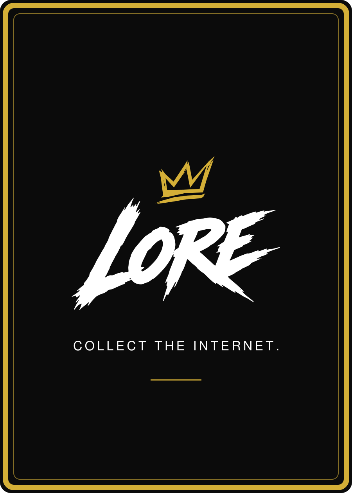

# LORE — approved shared card back

**Revision: LORE-BACK-v5. Approved by Daniel Payne, 12 September 2026.**

This shared back, together with the pinned [LORE-FRONT-v3 layout and illustration style](07-FRONT-LAYOUT-AND-ART-MASTER.md), forms the locked visual card system **LORE-CARD-v1.0**.

[SVG vector master](master/shared-back-v5/LORE-Shared-Back-v5.svg) · [PNG reference](master/shared-back-v5/LORE-Shared-Back-v5.png) · [Asset manifest](master/shared-back-v5/manifest.json) · [Approval record](../operations/12-SHARED-BACK-V5-APPROVAL-2026-09-12.md)

## Locked design

- One identical back across creators and rarities.
- Obsidian #0B0B0B background.
- Exact LORE-04-v1.0 compact logo: Rising Strokes crown in Gold #D4AF37 and preserved brush wordmark in White #FFFFFF.
- Exact outlined master tagline: **COLLECT THE INTERNET.**
- Thick gold outer border, clearer thin inner border and the existing small gold rule below the tagline.
- No diamond or other background pattern.
- Public moment QR and card-specific information stay on the front and linked moment page.

| Element | Exact geometry in the 900 × 1260 SVG canvas |
| --- | --- |
| Background | w 900, h 1260; radius 28; #0B0B0B |
| Outer gold border | x 14, y 14, w 872, h 1232; radius 22; stroke 14; opacity 1 |
| Inner gold border | x 35, y 35, w 830, h 1190; radius 16; stroke 2; opacity 0.6 |
| Compact logo | x 130, y 340, w 640, h 507; native viewBox 0 0 1200 950; uniform meet scaling |
| Outlined tagline | x 145, y 823, w 610, h 131; native viewBox 0 0 1400 300; uniform meet scaling |
| Gold rule | x 385 to 515, y 971; stroke 3 |
| Diamond | Absent |

All dimensions above are SVG units, not an approved physical print specification. Preserve the complete SVG, including the nested assets' built-in whitespace and transforms. Do not redraw, re-centre, resize individual logo components, add a pattern or replace lettering with fonts.

## Production adaptation

The visual design and [63 × 88 mm finished size](09-PHYSICAL-SIZE-STANDARD.md) are locked. Bleed, safe inset, corner die, registration tolerance, substrate, colour and foil remain unapproved. Use the chosen printer's actual template and physical proof to settle these. A thicker border is not itself a verified cutting allowance. Any visible adjustment must be presented as a new proof; this master must stay reproducible.

Creator permission, final moments, live moment routes, physical QR testing and the concealed ownership-claim mechanism remain separate release items in [card-design-lock.json](card-design-lock.json).
