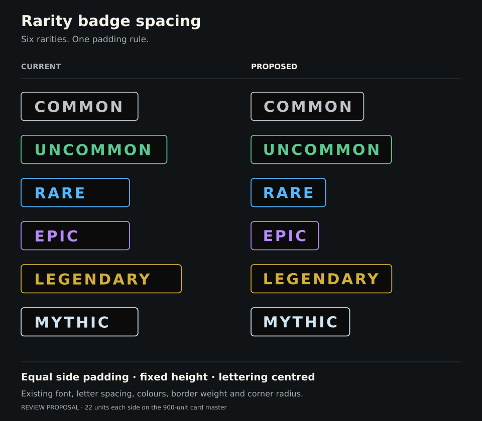

# Rarity badge spacing — LORE-BADGE-v1.0

**Approved by Dan Payne on 13 September 2026:** “agreed, right hand version is approved”. This approves the proposed right-hand badges in the comparison and their application to the existing approved cards, six templates, renderer and project rules.

## Fixed rule

Use the actual visible letter shapes in the pinned DejaVu Sans Bold font at 25 units with 3-unit tracking. Keep **22 SVG units between the lettering and each side border centreline**. Therefore badge width equals visible glyph width plus 44 units. Do not estimate by letter count, include a trailing tracking gap, use a minimum width, or stretch the lettering.

The badge remains at x=50, y=49, height=47, corner radius=5 and stroke width=1.5. Keep the existing fill, rarity colours and font. Centre the visible glyph bounds vertically. Small adjustments to the text x/baseline account for font bearings; they do not change font size or tracking. All values refer to the 900 × 1260 visual master.

| Rarity | Badge width | Text x | Text baseline |
| --- | ---: | ---: | ---: |
| Common | 186.9910 | 70.7549 | 81.6003 |
| Uncommon | 233.1640 | 69.7051 | 81.6003 |
| Rare | 123.8008 | 69.7051 | 81.6125 |
| Epic | 112.1553 | 69.7051 | 81.6003 |
| Legendary | 233.5640 | 69.7051 | 81.6003 |
| Mythic | 163.7120 | 69.7051 | 81.6003 |

The machine-readable authority is [badge-spacing.json](master/front-v4/badge-spacing.json), measured using the existing isolated font configuration. The six [v4 templates](master/front-v4/templates) contain these exact values. The [v4 renderer](master/front-v4/source/render_card.py) reapplies the rule and rejects changed badge typography or border treatment. Run [verify_layout.py](master/front-v4/source/verify_layout.py) to measure actual rendered letter bounds and check the card derivatives.

## Scope and versioning

LORE-FRONT-v4 supersedes v3 for current layout work. LORE-CARD-v1.1 records this sole visual revision. Keep the complete original v3 templates, font assets, illustrations and historical card files unchanged. Reuse the v3 fonts and original art/style references in v4; no art regeneration is involved.

The four finished cards receive new PNG/SVG versions. [Current card records](creators/asmongold/current-cards.json) identify the active files, original versions, exact hashes and approval scope. Per-card `badge-v4-approval.json` files record the same evidence. Pixel checks must show zero changes outside the badge, and SVG checks must show only badge width and label x/y changes. The source images, artwork transforms, creator/title/phrase copy, logo, counter, QR and all other layout remain fixed.

The shared back v5, 63 × 88 mm finished size, original wording approvals and separate source/QR/print-release status are unchanged. No later visual revision may be inferred from this approval.
