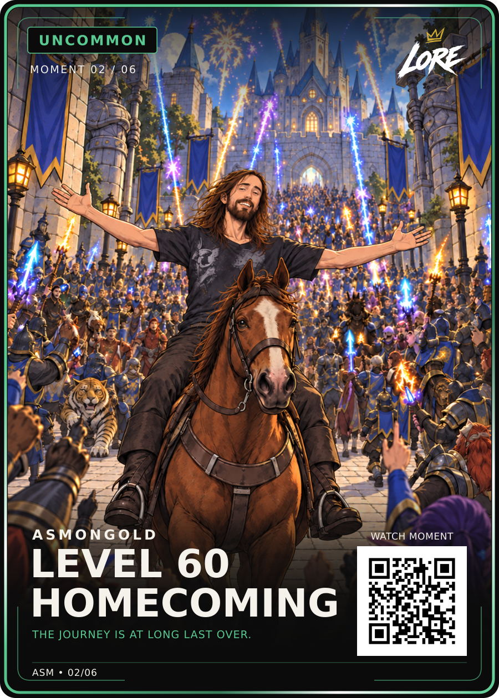

# Asmongold — Level 60 Homecoming

**Visually approved by Dan Payne on 13 September 2026. Uncommon · Moment 02 / 06.**

Dan selected the original plain-blue-flag card in his attached reference and instructed: **“Ok, I don’t like that, go back to original and upload to github”**. This rejects the subsequent gold LORE crown additions on the flags and tabards. Preserve the exact original illustration, relaxed expression, original tabards, plain blue flags, card copy and v4 layout. The approved LORE logo at the card’s upper right remains.

The PNG and SVG are byte-identical to the original Review-v1 exports, copied to the approved filenames without regeneration. `approval.json` records this later approval; it supersedes the earlier review-only status embedded in the unchanged SVG metadata. `manifest.json` holds hashes and dimensions. `art.png` is the exact embedded artwork and `approved-user-reference.jpeg` is Dan’s supplied selection reference. The rejected crown revision is not an approved master and has not been uploaded into this folder.

- Title: **LEVEL 60 / HOMECOMING**
- Phrase: **THE JOURNEY IS AT LONG LAST OVER.**
- Layout: **LORE-FRONT-v4**, using its pinned Uncommon badge, logo, fonts and QR geometry.
- Reference canvas: **900 × 1260**. Finished trim: **63 × 88 mm**; this is not a printer-prepared derivative.
- QR: reserved demo URL `https://example.com/lore/asm/02`; no live moment page.
- Phrase: displayed wording visually approved; original audio/timestamp verification remains open. The user’s supplied continuation text is the current source lead.

Use the exact saved files for delivery. `card-data.json` records reusable renderer inputs. Source verification, creator permissions, print preparation and physical QR testing remain separate from this visual approval.
