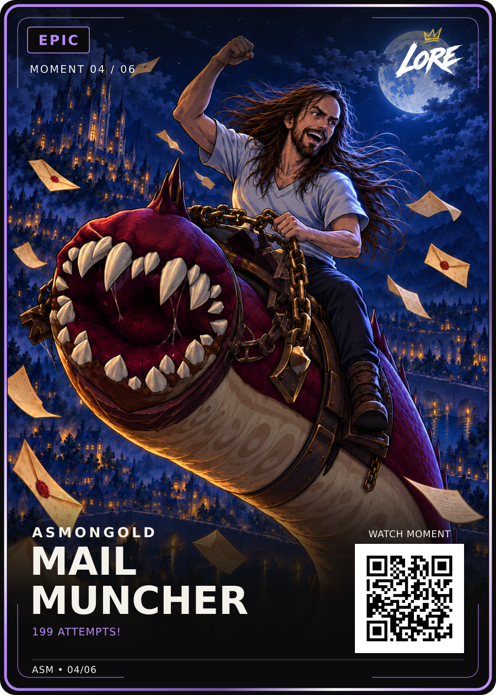
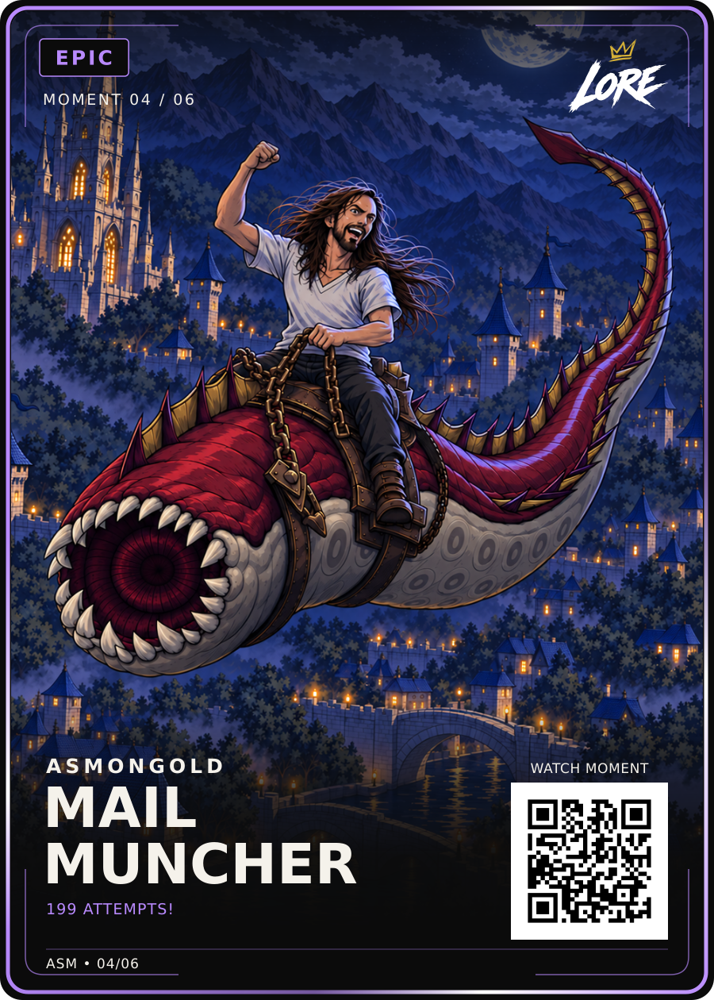

# Asmongold — Mail Muncher

## Current approved version — v6 rising scene

Dan approved the displayed Revised Review v2 on 13 September 2026: **“yup, lock it in, approved for upload”**.

- [Approved PNG](LORE-Asmongold-Mail-Muncher-Epic-v6.png) and [editable SVG](LORE-Asmongold-Mail-Muncher-Epic-v6.svg): exact approved review bytes under canonical v6 filenames.
- [Approved artwork](art-rising-v1.png), [approval record](rising-v6-approval.json), [hash manifest](manifest.json), [revision and reference notes](revision-v6-notes.json).

The mount rises from the bottom of the card, with a central dorsal crest and a single back ridge. Deep blue moonlit shadows and amber city light connect rider, mount and setting. Windblown parchment envelopes use actual WoW game references. Preserve this exact selected illustration and its approved framing. Earlier v4/v5 and original art files below remain historical.

Epic / Moment 04/06, MAIL MUNCHER, 199 ATTEMPTS!, the fixed LORE logo, frame, fonts, equal badge padding and QR are unchanged. Visual master: 900 × 1260; finished trim: 63 × 88 mm. Source/count verification, live QR, creator permissions and printer release remain separate.

## Historical v5 — badge spacing v4

Dan approved the right-hand spacing comparison on 13 September 2026: **“agreed, right hand version is approved”**. This authorises the same badge change on this previously approved card. The historical v5 files are [LORE-Asmongold-Mail-Muncher-Epic-v5.png](LORE-Asmongold-Mail-Muncher-Epic-v5.png) and [LORE-Asmongold-Mail-Muncher-Epic-v5.svg](LORE-Asmongold-Mail-Muncher-Epic-v5.svg). See [approval and exact hashes](badge-v4-approval.json).

Only badge width and label centring change. Actual glyph padding is 22 units on each side. The font, border treatment, art, QR, copy and every pixel outside the badge remain unchanged. Earlier files and approval records below are retained as history; use the v6 files above for current deliveries.

## Previous approved revision (history)

**V4 visual approved by Daniel Payne on 12 September 2026.**

Dan selected this exact version with “thats the one, what do you think?” and then instructed: “ok lock it in and see if yoiu can uplaod to github, if not i will do it”. This approves the illustration, lighting, crop, card layout and displayed wording. It does not confer print release or third-party rights clearance.

## Locked files

- [Approved card PNG](LORE-Asmongold-Mail-Muncher-Epic-Layout-Review-v4.png) — 900 × 1260, the exact reviewed visual.
- [Editable card SVG](LORE-Asmongold-Mail-Muncher-Epic-Layout-Review-v4.svg) — exact matching master, with embedded illustration.
- [Approved uncropped artwork](art.png) — 1060 × 1484, unchanged original.
- [Manifest, approval evidence and SHA-256 / Git blob hashes](manifest.json).

The original `Layout-Review-v4` filenames are retained despite approval. Do not regenerate, substitute an earlier variant or render a replacement merely to rename it. Use the approved PNG for consistent visual review; editable SVG text depends on the pinned font configuration.

## Locked visual decisions

- Title: **MAIL MUNCHER**. Epic treatment. Phrase: **199 ATTEMPTS!**
- Asmongold's raised-fist pose on the selected mount; circular mouth and teeth, crest/spike arrangement and natural seated legs preserved.
- Breathing room around the mouth and tail; the foreground tower above the QR removed.
- Hand-drawn anime treatment across the rider, creature and city, matching the approved original LORE style references.
- Cool upper-right moonlight, clearer saddle/underside shadows and softened warm frontal lighting on the teeth and belly.
- Exact LORE-04-v1.0 logo and LORE-FRONT-v3 Epic template; existing type, QR geometry and artwork transform retained.

## Separate open work

The exact 199-attempt count and source timestamp remain to be checked against the [source video lead](https://www.youtube.com/watch?v=RFctq5QeZBY). The phrase is user-selected wording, not a verified verbatim quote. The QR is a demo, 04/06 remains provisional collection numbering, and commercial permissions and printer-specific release remain open. These do not reopen the recorded visual approval.
