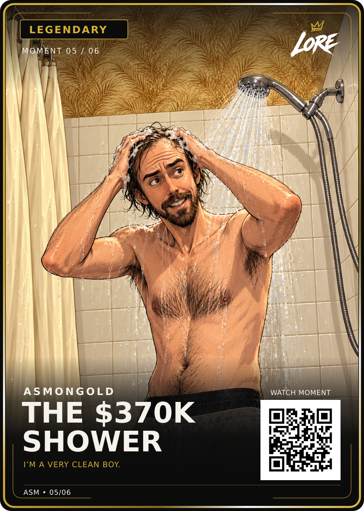

# Asmongold — The $370K Shower

## Current approved version — v3 with illustrated steam

Dan approved the displayed steam revision on 13 September 2026: **“yeah, i think this is better, approved for upload”**.

- [Approved PNG](LORE-Asmongold-Shower-Legendary-v3.png) and [editable SVG](LORE-Asmongold-Shower-Legendary-v3.svg): exact bytes of Steam Review v1, renamed to the canonical v3 filenames.
- [Steam artwork](art-steam-v1.png), [approval record](steam-v3-approval.json), [current hash manifest](manifest.json).

The added steam rises around the showerhead and upper tiles and behind his shoulders, with subtle tile condensation. The card layout, original QR, title, phrase, Legendary colour, Moment 05/06, approved badge spacing and logo remain fixed. The SVG changes only its embedded illustration. Earlier files below are retained as history and must not replace this v3 selection in current deliveries.

Source verification, live QR, creator permissions and physical print release remain separate. The finished dimensions remain 63 × 88 mm; the visual master is 900 × 1260.

## Historical version v2 — badge spacing v4

Dan approved the right-hand spacing comparison on 13 September 2026: **“agreed, right hand version is approved”**. This authorises the same badge change on this previously approved card. The v2 files are [LORE-Asmongold-Shower-Legendary-v2.png](LORE-Asmongold-Shower-Legendary-v2.png) and [LORE-Asmongold-Shower-Legendary-v2.svg](LORE-Asmongold-Shower-Legendary-v2.svg). See [approval and exact hashes](badge-v4-approval.json).

Only badge width and label centring change. Actual glyph padding is 22 units on each side. The font, border treatment, art, QR, copy and every pixel outside the badge remain unchanged. Earlier files and approval records below are retained as history; use the v3 steam files above for current deliveries.

## Previous approved revision (history)

**Visual approval: approved by Daniel Payne on 12 September 2026.**

Dan approved the displayed shower card in the LORE conversation and subsequently authorised its GitHub upload. This record covers the unchanged PNG and matching SVG identified below. Their original `Review-v1` filenames are retained to preserve file identity; the filename does not mean another visual approval is required.

## Repository location

Repository: `d4np4yn3-netizen/Lore`

Folder: `cards/creators/asmongold/shower-master-01/`

This is a separate folder alongside `steak-master-01`.

## Files

| Filename | Purpose | Size |
| --- | --- | --- |
| `README.md` | Card details, approval record and outstanding production work | This document |
| `LORE-Asmongold-Shower-Legendary-Review-v1.png` | Approved card visual; 900 × 1260 pixels | 1,716,624 bytes |
| `LORE-Asmongold-Shower-Legendary-Review-v1.svg` | Matching card layout; embedded raster illustration with editable text and vector layout elements | 3,781,326 bytes |

## Card details

| Field | Displayed value |
| --- | --- |
| Creator | ASMONGOLD |
| Title | THE $370K SHOWER |
| Moment phrase | I’M A VERY CLEAN BOY. |
| Displayed rarity | LEGENDARY |
| Moment label | MOMENT 05 / 06 |
| Set label | ASM • 05/06 |
| Visual dimensions | 900 × 1260 |
| Brand master | LORE-04-v1.0 |
| Front layout | LORE-FRONT-v3 |
| Shared back | Existing LORE-BACK-v5 in `cards/master/shared-back-v5/` |
| Locked finished card size | 63 × 88 mm; separate printer-specific exports remain required |

The moment was selected by Dan, who supplied this [YouTube video](https://www.youtube.com/watch?v=QYsd4KiMfq0) and the phrase shown on the card. Primary audio and exact quotation timestamp verification remain open. The fundraising figure in the title refers to the charity-stream total, not a single donation or price for the shower, as documented in the original source notes.

## Approval scope and remaining work

- Preserve the approved illustration, crop, branding, colours, wording and layout. Do not regenerate the image or substitute a different version during upload.
- Visual approval covers the displayed Legendary treatment. Final collection rarity allocation and the `05/06` numbering remain provisional.
- The QR currently encodes the demonstration address `https://example.com/m/asm/shower`; it does not open the supplied video. A live destination and scan verification remain required.
- Creator permissions, final six-moment selection, printer requirements, bleed, safe area and print release are separate from this visual approval.
- Keep the existing steak files, master templates, brand assets and shared back unchanged.

## Exact file verification

These values were checked against the actual packaged exports when this upload pack was prepared on 12 September 2026.

| Export | SHA-256 |
| --- | --- |
| PNG | `569cc184fde33a3ee3c987feec2b1f559092ef2042ff61d1685f8f6b7a77d277` |
| SVG | `c1e02b46c76c3d679887c150b40191f107b4b59655518100f5593a766b2f9a15` |

Git blob SHA-1 values for checking the remote files:

- PNG: `c8bc8c4b0c0070354ca6461acd586cc9966678f3`
- SVG: `c6e6053d36de2a8a894c4ee8f58b4e2fe99907d7`

## Manual upload

1. Extract `LORE-Asmongold-Shower-GitHub-Upload.zip` on your computer.
2. Open `cards/creators/asmongold/` on GitHub.
3. Select **Add file → Upload files** and drag the extracted **shower-master-01** folder into the upload area.
4. Confirm that this creates the three files inside `cards/creators/asmongold/shower-master-01/`.
5. Commit with the message `Add approved Asmongold shower card and approval record`.
6. Open the new folder after committing and check that the PNG displays and both exports are present. Remote upload verification is a separate step; this document alone does not prove the exports were committed.
