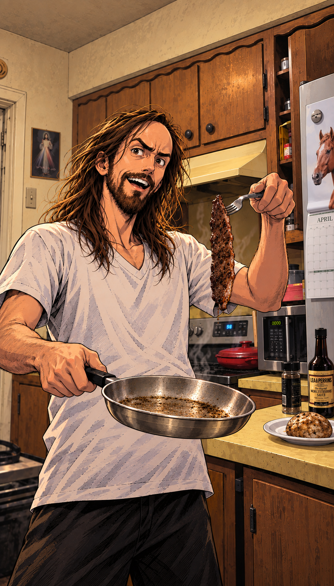

# The $2 Steak — selected artwork

**Artwork approved by Daniel Payne on 2026-09-12:** “This is the one!” The [exact attached selection](approved-user-reference.jpeg) is preserved. [art.png](art.png) is the corresponding original generation, with the same composition at its original PNG resolution; it has not been redrawn or retouched. The JPEG and PNG are different encodings/resolutions, not byte-identical files.



## Final assembled card

Daniel requested the complete card and explicitly authorised a slight image move or rescale to clear the potato from the QR. The final assembly uses the locked LORE v3 Common template and shifts **only the artwork upward by 70 SVG units**. There is no rescaling, redrawing or retouching. The logo, text, font files, borders, gradients, name/title and QR location are unchanged. This delivered composition awaits Daniel's confirmation; approval of the original illustration is already recorded.


[Download final front PNG](LORE-Asmongold-Steak-Final-v1.png) · [Editable final SVG container](LORE-Asmongold-Steak-Final-v1.svg) · [Original art PNG](art.png) · [Reference comparison](comparison.png) · [Verification](final-qa.json)

The SVG retains vector branding, text and QR with an embedded raster illustration; it is not all-vector artwork. The final 900 × 1260 composition keeps the potato above the fixed QR and its caption. The full approved illustration remains intact above. The earlier unadjusted `front.png` / `front.svg` are retained only as historical crop proofs, not the current deliverable.

**Common**, **01/06**, and the QR destination `https://example.com/m/asm/01` remain demo values. The QR does not yet open the real moment. Standard finished trim is 63 × 88 mm; printer-specific files and a physical scan test are still needed.

## Reproduce

From the repository root, with the renderer's documented dependencies installed:

```sh
python cards/creators/asmongold/steak-master-01/build-final-front.py
```

[Source notes](source-notes.md) · [Asset manifest and checks](manifest.json) · [Illustration consistency standard](../../../10-ILLUSTRATION-CONSISTENCY.md)
