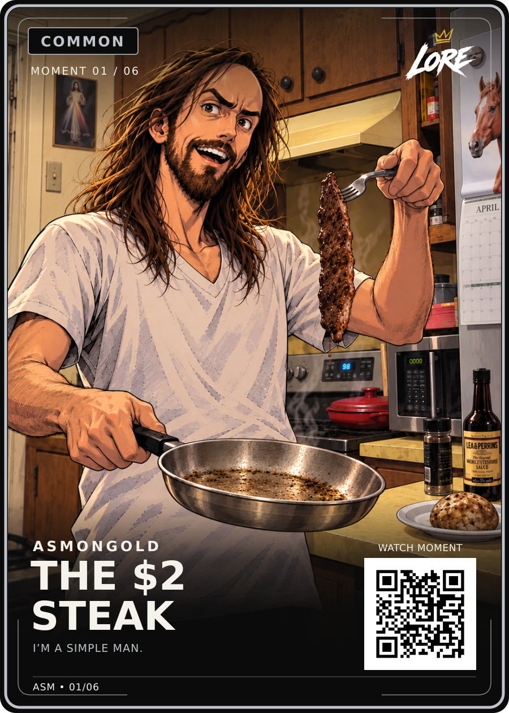

# The $2 Steak — selected artwork

**Artwork approved by Daniel Payne on 2026-09-12:** “This is the one!” The [exact attached selection](approved-user-reference.jpeg) is preserved. [art.png](art.png) is the corresponding original generation, with the same composition at its original PNG resolution; it has not been redrawn or retouched. The JPEG and PNG are different encodings/resolutions, not byte-identical files.


## Final assembled card

**Visual sign-off recorded on 2026-09-12.** Dan selected **I’M A SIMPLE MAN.** beneath the title and asked to get this card signed off. v2 replaces only `THE COOKING VIDEO` with that phrase; every other element matches the delivered v1. See [the sign-off record](../../../../operations/15-STEAK-V2-VISUAL-SIGNOFF-2026-09-12.md).

The card uses the locked LORE v3 Common template and retains the previously authorised **70 SVG unit upward artwork translation** to clear the potato from the QR. No rescaling, redrawing or retouching. The logo, other text, font files, borders, gradients, name/title and QR location are unchanged.



[Download final front PNG](LORE-Asmongold-Steak-Final-v2.png) · [Editable final SVG container](LORE-Asmongold-Steak-Final-v2.svg) · [Original art PNG](art.png) · [Reference comparison](comparison.png) · [Verification](final-qa-v2.json)

The SVG retains vector branding, text and QR with an embedded raster illustration; it is not all-vector artwork. The final 900 × 1260 composition keeps the potato above the fixed QR and its caption. The full approved illustration remains intact above. The earlier unadjusted `front.png` / `front.svg` and the `Final-v1` files are retained as historical versions; v2 is the current visual master.

The phrase is user-selected; primary audio/timestamp verification remains open in [source notes](source-notes.md). Visual sign-off does not certify quotation accuracy or print release.

**Common**, **01/06**, and the QR destination `https://example.com/m/asm/01` remain demo values. The QR does not yet open the real moment. Standard finished trim is 63 × 88 mm; printer-specific files and a physical scan test are still needed.

## Reproduce

From the repository root, with the renderer's documented dependencies installed:

```sh
python cards/creators/asmongold/steak-master-01/build-final-front.py
```

[Source notes](source-notes.md) · [Asset manifest and checks](manifest.json) · [Illustration consistency standard](../../../10-ILLUSTRATION-CONSISTENCY.md)
