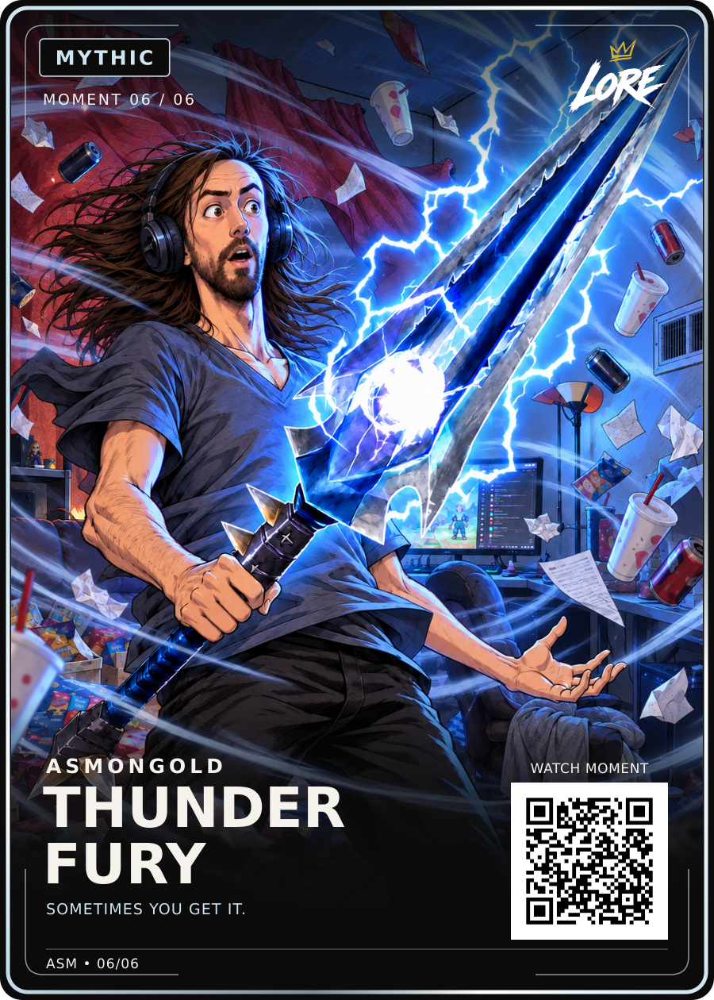

# Thunderfury — Mythic / Moment 06 of 06

**Visually approved by Dan Payne on 13 September 2026.** “we will stick with this, its too good to start tweaking, approved for upload to github”.

- [Approved PNG](LORE-Asmongold-Thunderfury-Mythic-v1.png) — exact bytes of Dan’s attached original card.
- [Editable SVG](LORE-Asmongold-Thunderfury-Mythic-v1.svg) — unchanged original Review-v1 source.
- [Original artwork](art.png), [render data](card-data.json), [approval](approval.json), [hash manifest](manifest.json).

Title: **THUNDER / FURY**. Phrase: **SOMETIMES YOU GET IT.** Current allocation: **Mythic, Moment 06/06**; Dan may review the rarity order with all six cards together.

Preserve the original diagonal sword, surprised expression, grey V-neck, headset, room storm and the original sword/logo overlap. Dan chose the original after the clearance experiment; the more upright sword version must not replace it. Use the pinned LORE-FRONT-v4 layout and equal-padding badge rule, exact LORE-04 logo, universal back v5 and 63 × 88 mm trim.

Phrase source: [Thunderfury video, around 16:00](https://www.youtube.com/watch?v=sMLqYainAOQ&t=960s). The prior conversation checked auto-generated captions; primary audio verification, a live LORE QR route, creator permissions and print release remain separate. The card QR is demo-only.
