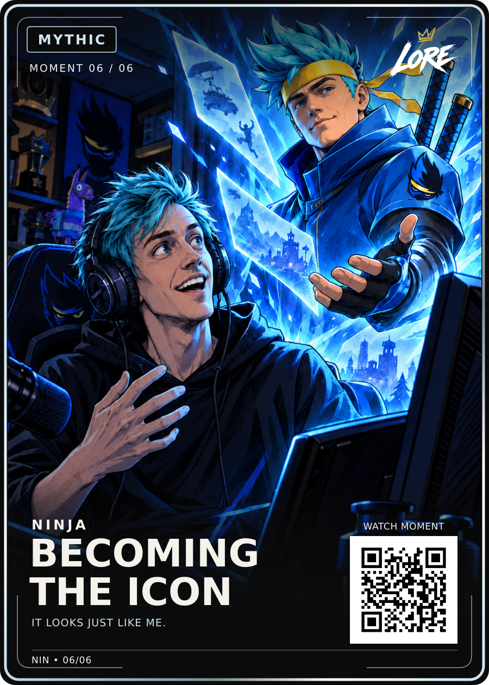

# Becoming the Icon — Mythic / Moment 06 of 06

**Visually approved by Dan Payne on 13 September 2026:** “Approved upload to github”.

- [Approved PNG](LORE-Ninja-Becoming-The-Icon-Mythic-v1.png) and [editable SVG](LORE-Ninja-Becoming-The-Icon-Mythic-v1.svg): exact approved Review-v4 bytes.
- [Original approved artwork](art.png), [render data](card-data.json), [approval](approval.json), [hash manifest](manifest.json), [source notes](source-notes.md).

Title: **BECOMING / THE ICON**. Phrase: **IT LOOKS JUST LIKE ME.** Creator: **NINJA**. Current allocation: **Mythic / Moment 06/06**.

Preserve the darker v3 illustration, matching blue-grey eyes, strong ink and cel shading, and directional cyan light from the avatar across Ninja and the room. Earlier lighter or more photographic drafts are superseded. The exact locked LORE front-v4 layout, logo, typography, numbering and QR are preserved. The source SVG was copied without re-rendering.

The reviewed QR remains demo-only. Audio/timestamp verification, live LORE routing, permissions and physical print release remain separate from visual approval.
