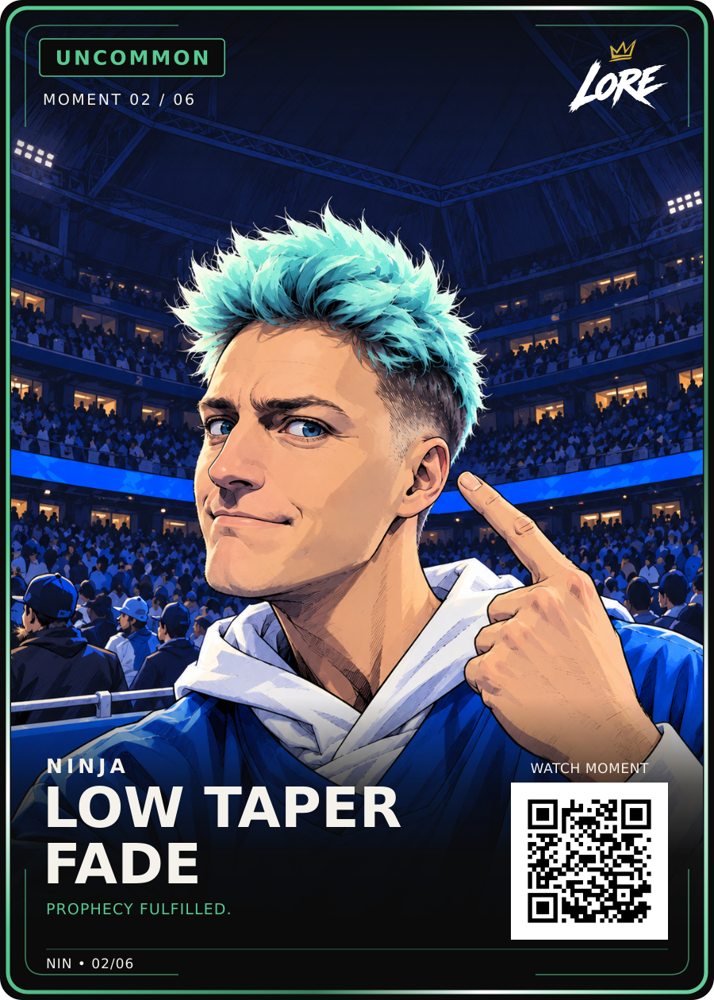

# Low Taper Fade — Uncommon / Moment 02 of 06

**Visually approved by Dan Payne on 14 September 2026:** “Lock that in. Add to GitHub and the site”.

[PNG](LORE-Ninja-Low-Taper-Fade-Uncommon-v1.png) · [Editable SVG](LORE-Ninja-Low-Taper-Fade-Uncommon-v1.svg) · [Artwork](art.png) · [Approval](approval.json) · [Source notes](source-notes.md) · [Manifest](manifest.json)

Title: **LOW TAPER / FADE**. Phrase: **PROPHECY FULFILLED.**
The approved Review-v1 files and selected illustration are preserved exactly.
LORE-FRONT-v4, shared back v5 and 63 × 88 mm trim remain locked.
The phrase is verified as the NFL on CBS source-post caption.
Canonical QR remains the reviewed demo; website QR sample is a separate derivative.
Physical print release remains separate.
