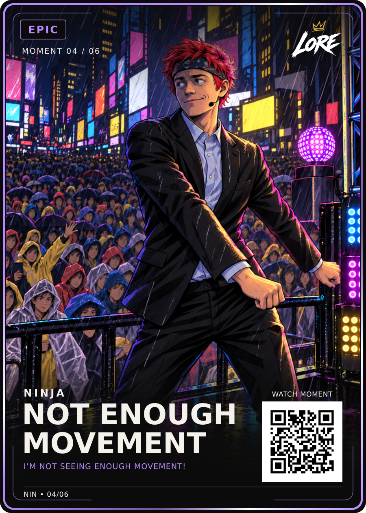

# Not Enough Movement — Epic / Moment 04 of 06

**Visually approved by Dan Payne on 13 September 2026:** “Lock it in and upload to github! Two great cards so far”.

- [Approved PNG](LORE-Ninja-Not-Enough-Movement-Epic-v1.png) and [editable SVG](LORE-Ninja-Not-Enough-Movement-Epic-v1.svg): exact approved Review-v4 bytes.
- [Approved illustration](art.png), [render data](card-data.json), [approval](approval.json), [hash manifest](manifest.json), [source notes](source-notes.md).

Title: **NOT ENOUGH / MOVEMENT**. Phrase: **I’M NOT SEEING ENOUGH MOVEMENT!** Creator: **NINJA**. Allocation: **Epic / Moment 04/06**.

Preserve the hand-drawn anime treatment throughout Ninja and the crowd, red hair and dark bandana, cool viewer-left face shadow, yellow/pink directional light, and softened final cheek highlight. Review v1-v3 are superseded. The exact locked LORE front-v4 logo, typography, badge, numbering and QR are preserved.

The reviewed QR is demo-only. Original audio/timestamp verification, live routing and physical print release remain separate from visual approval.
