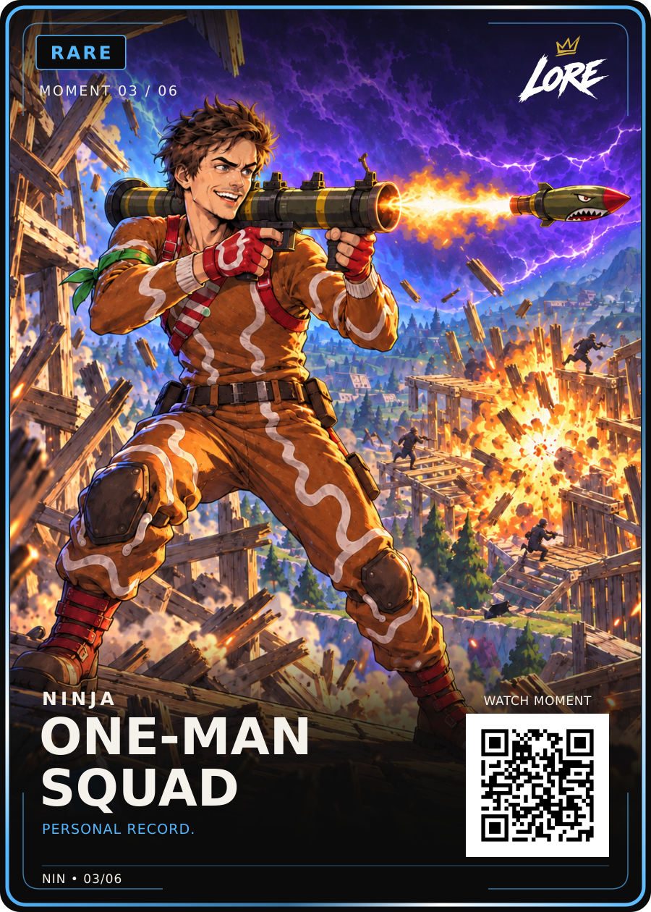

# One-Man Squad — Rare / Moment 03 of 06

**Visually approved by Dan Payne on 14 September 2026:** “Ok approved for github and site!”.

[PNG](LORE-Ninja-One-Man-Squad-Rare-v1.png) · [Editable SVG](LORE-Ninja-One-Man-Squad-Rare-v1.svg) · [Artwork](art.png) · [Approval](approval.json) · [Source notes](source-notes.md) · [Manifest](manifest.json)

Title: **ONE-MAN / SQUAD**. Phrase: **PERSONAL RECORD.**
The exact approved Review-v4 PNG/SVG and selected art-v4 are preserved.
Keep the grounded firing stance, straight olive launcher, gingerbread costume,
orange blast illumination, blue storm highlights and drawn wooden structures.
LORE-FRONT-v4, shared back v5 and 63 × 88 mm trim remain locked.

The source is Ninja's original 32-kill solo-squads video. PERSONAL RECORD is
verified thumbnail copy, not a spoken quote. The outfit comes from actual
gameplay preview frames; Ninja's likeness in that costume is an interpretation.
Canonical QR retains the reviewed demo; the website QR derivative is separate.
Physical print release remains separate.
