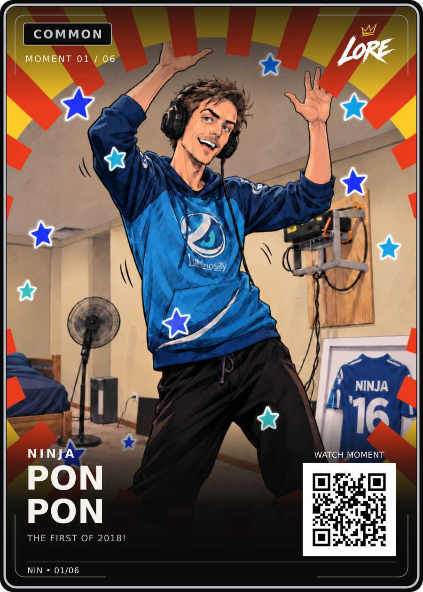

# Pon Pon — Common / Moment 01 of 06

**Visually approved by Dan Payne on 13 September 2026:** “Ok approved for upload, this turned out better than I thought”.

- [Approved PNG](LORE-Ninja-Pon-Pon-Common-v1.png) and [editable SVG](LORE-Ninja-Pon-Pon-Common-v1.svg): exact approved review revision 2 bytes.
- [Selected illustration](art.png), [render data](card-data.json), [approval](approval.json), [hash manifest](manifest.json), [source notes](source-notes.md).

Title: **PON / PON**. Phrase: **THE FIRST OF 2018!** Creator: **NINJA**.
Allocation: **Common / Moment 01/06**. Layout: **LORE-FRONT-v4**.

Preserve the selected hand-drawn scene, circular burst, longer inward red bars,
hands behind the border, stars and exact card crop. Earlier rejected iterations
are not the master. The previous blank-phrase review is superseded.

Phrase supplied and approved by Dan; independent primary audio/timestamp
verification remains open. QR is demo-only. This is not a physical print release.
