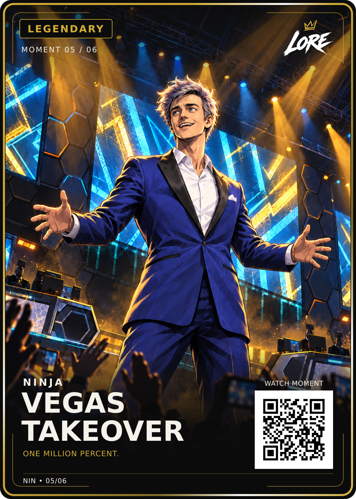

# Vegas Takeover — Legendary / Moment 05 of 06

**Visually approved by Dan Payne on 14 September 2026:** “Yep, let's lock that in, add it to GitHub and add it to the site.”.

[PNG](LORE-Ninja-Vegas-Takeover-Legendary-v1.png) · [Editable SVG](LORE-Ninja-Vegas-Takeover-Legendary-v1.svg) · [Artwork](art.png) · [Approval](approval.json) · [Source notes](source-notes.md) · [Manifest](manifest.json)

Title: **VEGAS / TAKEOVER**. Phrase: **ONE MILLION PERCENT.**
The approved Review-v2 PNG/SVG and selected art-v2 illustration are preserved
exactly. Keep the blue tuxedo, black lapels, open white shirt, silver/lavender
hair, welcoming expression, inward hands, gold/cyan lighting and drawn arena.
LORE-FRONT-v4, shared back v5 and 63 × 88 mm trim remain locked.
The phrase is verified in the official venue archive description as an attributed
Ninja quotation. Independent audio/timestamp verification remains open.
Canonical QR retains the reviewed demo; the website QR sample is separate.
Physical print release remains separate.
