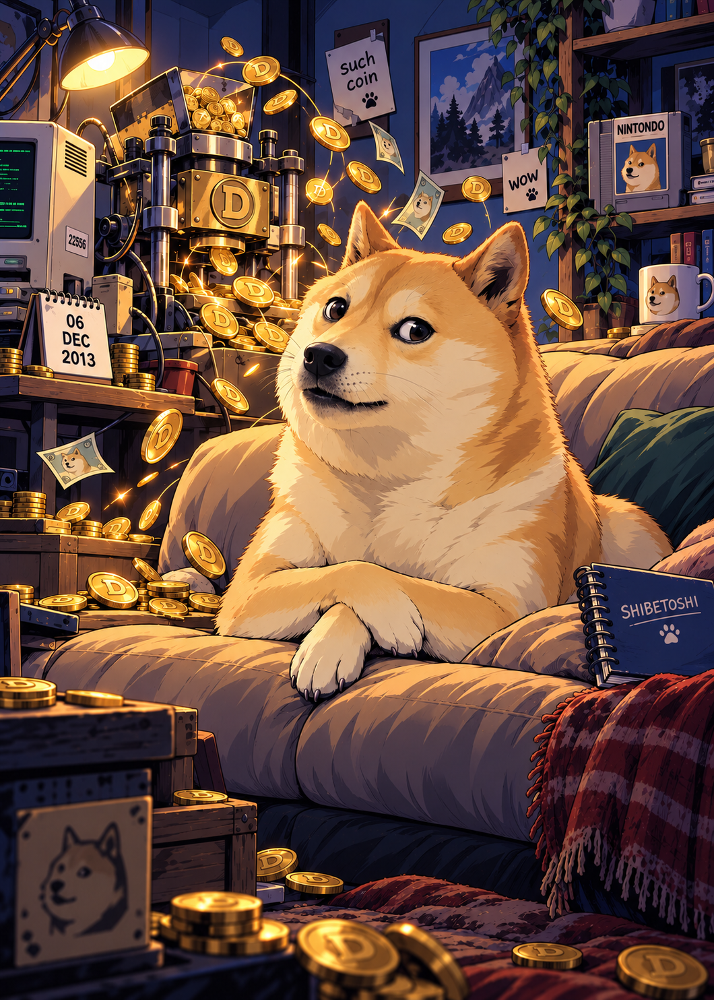
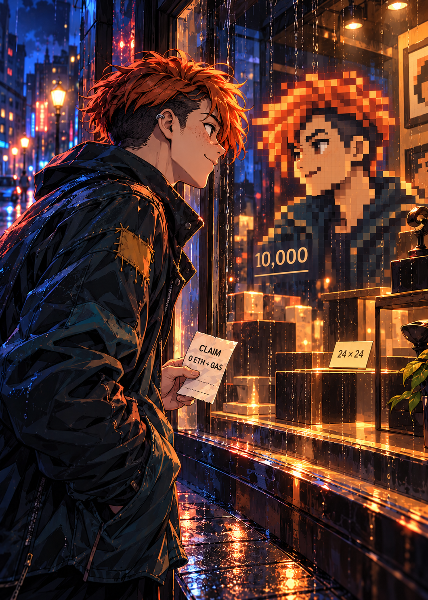
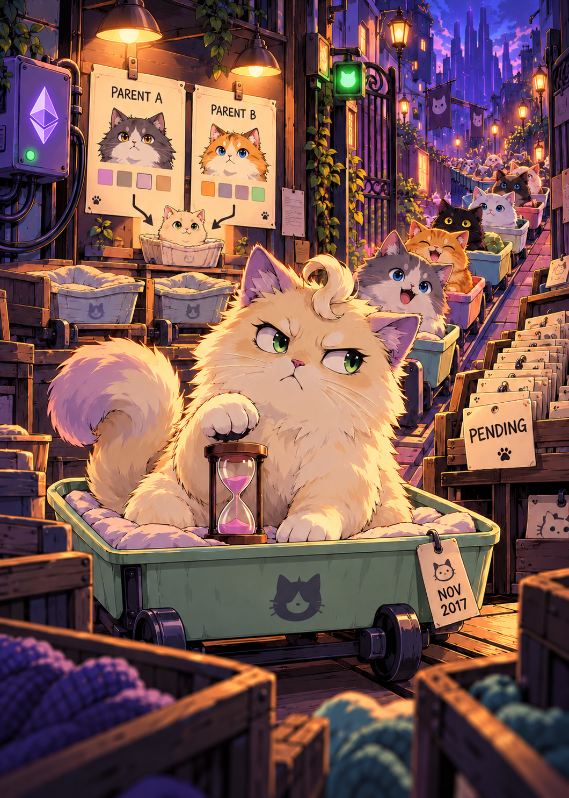

# HISTROVE Crypto style reference pack

**HISTROVE-CRYPTO-STYLE-v1.2 · 8 October 2026**

The required pack contains **HODL 021, Birth of Doge 020, CryptoPunks 038 and CryptoKitties 046**. Use all four exact, approved raw illustrations before every new Crypto Season One card and every artwork edit, across the current 100-card collection and all rarities. CryptoPunks and CryptoKitties extend the existing HODL/Doge pack; the two original references remain pinned. Creator collections keep their separate references.

## The four exact references

| HODL 021 | Birth of Doge 020 | CryptoPunks 038 | CryptoKitties 046 |
| --- | --- | --- | --- |
|  |  |  |  |
| Expressive human drawing, structured cel shadows, cinematic contrast | Creature expression, grouped fur, coherent materials and room | Mature anime character, selective rain and reflections, architectural depth | Expressive creatures, layered perspective, story props and integrated light |

Resolve exact repository paths, byte counts, dimensions, SHA-256 hashes and Git blobs through [style-reference-lock.json](style-reference-lock.json), under `required_references[].art`. The existing HODL and Doge `master-02` paths are retained; the numbered 021 and 020 aliases contain identical artwork bytes. Use the corrected 046 artwork with the upper-right Ethereum symbol removed, not the earlier review variant.

**Supply the raw art PNGs, not framed cards, print proofs, screenshots or web derivatives.** The images above link to existing approved assets; no duplicate binary pack is needed. Historical `master`, `card` and `editable_svg` fields preserve provenance and do not reduce the four-image requirement.

## Match the entire scene

- Mature, confident anime/manhwa drawing with deliberate contours, line-weight hierarchy, clear hands and strong silhouettes
- Expressive faces and creatures, angular planes and grouped hair/fur, with each subject's character suited to its own event
- Coherent two-to-three-tone cel shadows, smooth local colour and selective highlights
- Cinematic lighting that belongs to the scene: light direction, bounce, rim light and reflections should agree across subject, props and background
- Controlled texture and detail: simplify material planes; reserve rain, fur, wear and fine highlights for purposeful areas rather than covering everything in noise
- Consistent perspective and scale through the whole background, with readable architecture, believable object placement and atmospheric depth
- A premium illustrated finish that stays coherent across character, creature, object and environment; avoid photographic skin/fur, glossy 3D materials, indiscriminate scratchy hatching, random grunge and airbrushed faces

The references are complementary examples of the same rendering language. CryptoPunks is a useful maturity and lighting comparison; CryptoKitties is a useful creature, environment and perspective comparison. Neither makes every future card a rainy neon street or a cute animal scene. Palette, humour, composition, subjects and facts belong to the target event.

## Keep style separate from content and rights

Do not copy the reference characters, dog, cats, pixel portrait, logos, symbols, labels, machines, room or other distinctive motifs into an unrelated event. A factual reference supplies event content; the four approved illustrations supply drawing treatment. Intentional cross-card objects follow the existing [cross-card rules](COLLECTION-RULES.md#cross-card-easter-eggs--approved-direction-27-september-2026), including a documented source and appropriate placement.

Style-reference selection does **not** clear copyright, trademark, character, likeness or commercial-reproduction rights in the underlying artwork or depicted subjects. Visual selection, factual/source checks, rights review, digital QA and physical print acceptance remain separate.

## Required workflow

1. Resolve all four entries in the lock, verify their raw-art hashes and visually inspect the actual pixels before beginning a card
2. Supply all four exact art PNGs directly as STYLE references for every generation and artwork edit. Recover missing originals before proceeding. A text summary, remembered image, framed card or newer output cannot substitute. Record the actual paths and hashes used in that card's source record
3. Supply the target artwork separately as CONTENT/COMPOSITION when restyling, and factual sources separately as needed. Preserve the event's own palette, subject, composition and source-backed clues
4. Generate illustration only. Keep the selected event, rarity, copy, date and clues unless a change is requested. Draw clues in the same perspective, linework and lighting, distinguishing historical evidence from creative interpretation
5. Compose the exact approved HISTROVE identity, typography, card frame and QR separately through the current [HISTROVE print master](master/histrove-print-v1/README.md). Reference artwork does not change brand geometry, rarity colours, shared back or print dimensions
6. Compare the raw artwork and the finished card against all four references. Check maturity and expression, material texture, light integration, props and background perspective separately. Check clue visibility after title and QR overlays
7. Present one card for review, then preserve the exact selected files and earlier versions. Later card approvals do not silently replace or shrink this pack

This is a prospective reference-pack update. Existing approved artwork remains unchanged and retains its true generation history; do not claim older work used four inputs. It does not initiate the historical restyle queue or authorise regenerating an already approved card. See [STYLE-MIGRATION.md](STYLE-MIGRATION.md) for the preserved migration record and [current-cards.json](current-cards.json) for current assets.
