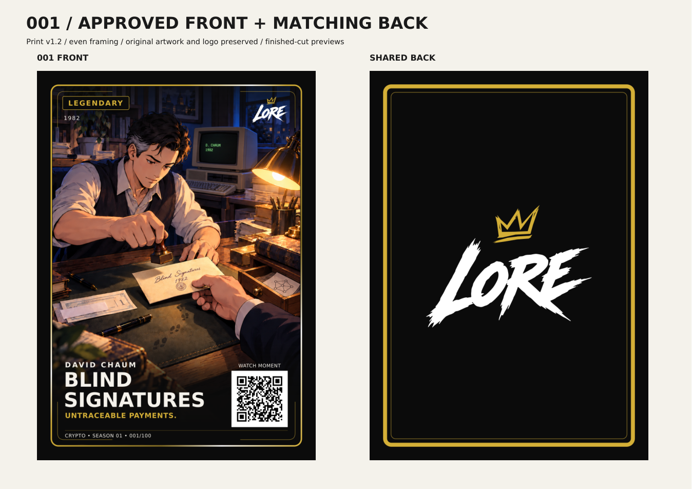

# Historical LORE revision — superseded 6 October 2026

Retained unchanged artwork and geometry for reproducibility. Current HISTROVE printer files: `cards/crypto/print-ready/histrove-v1`; future templates: `cards/crypto/master/histrove-print-v1`. Do not use this historical branding for new print runs.

# Approved Crypto cards — print v1.2

39 numbered fronts (001–039), plus one shared back, prepared with the even framing approved by Dan on 6 October 2026. This is the active printer-file folder. Previous masters stay in their original locations.

## Files to send to the printer

- **[Front PNGs](fronts/png)**: 816×1110 pixels at **300 DPI**, matching the supplied printer template.
- **[Front PDFs](fronts/pdf)**: the same physical page size; native illustration retained, text outlined and QR/logo/border vectors preserved.
- **[Shared back PNG](back/LORE-Shared-Back-v6-Print-v1.2.png)** · **[Shared back PDF](back/LORE-Shared-Back-v6-Print-v1.2.pdf)**.
- [Editable fronts](fronts/svg) and [editable back](back/LORE-Shared-Back-v6-Print-v1.2.svg) are available for future controlled revisions.

All clean printer files include bleed and exclude visible cut/safe guides. The `review` folder contains finished-cut previews and contact sheets; do not submit those review sheets as individual card files.

## Geometry and checks

Full bleed 816×1110; cut 744×1038 at x/y 36/36; safe 684×981 at x/y 66/64.5. Front frame clearance from each straight cut edge is 3.080 mm; back is 3.048 mm because of its heavier border. The card's physical size has not changed.

The illustration is proportionally enlarged by 2.2423% relative to the v1.1 inset proof, with a small additional crop at the sides. Original image bytes and all deliberate card-specific artwork offsets are preserved. Text sizes, wording, logo geometry, QR data and square proportions are unchanged from the agreed treatment. 001 renders pixel-identically to Dan's approved v1.2 PNG.

All 39 PNGs and actual 300-DPI PDF renders decode to their corresponding live `/crypto/NNN/` route. Dimensions, DPI, frame bounds, visible text bounds and outlined PDF lettering pass. See [manifest](manifest.json) and per-card [QA records](qa).

Dan approved the framing and collection rollout. The matching back applies that requested adaptation to the existing approved no-tagline v6 design; its new preview is supplied for review. **Printer acceptance and physical sample approval are not yet recorded.**

The three older unnumbered designs (The Merge, BitConnect and The Depeg) remain archived with placeholder QRs and are excluded from this agreed 001–039 print batch.

The website's displayed cards, full artwork, book pages and clue crops are unchanged. Its print links use this revision. Future cards must use [print-v1.2 templates and renderer](../../master/print-v1.2).

## Card files

| Number | Card | PNG | PDF | Editable |
| --- | --- | --- | --- | --- |
| 001 | BLIND SIGNATURES | [Legendary PNG](fronts/png/LORE-Crypto-001-Front-Print-v1.2.png) | [PDF](fronts/pdf/LORE-Crypto-001-Front-Print-v1.2.pdf) | [SVG](fronts/svg/LORE-Crypto-001-Front-Print-v1.2.svg) |
| 002 | CYPHERPUNK MANIFESTO | [Epic PNG](fronts/png/LORE-Crypto-002-Front-Print-v1.2.png) | [PDF](fronts/pdf/LORE-Crypto-002-Front-Print-v1.2.pdf) | [SVG](fronts/svg/LORE-Crypto-002-Front-Print-v1.2.svg) |
| 003 | HASHCASH POSTAGE | [Rare PNG](fronts/png/LORE-Crypto-003-Front-Print-v1.2.png) | [PDF](fronts/pdf/LORE-Crypto-003-Front-Print-v1.2.pdf) | [SVG](fronts/svg/LORE-Crypto-003-Front-Print-v1.2.svg) |
| 004 | RPOW REUSABLE | [Rare PNG](fronts/png/LORE-Crypto-004-Front-Print-v1.2.png) | [PDF](fronts/pdf/LORE-Crypto-004-Front-Print-v1.2.pdf) | [SVG](fronts/svg/LORE-Crypto-004-Front-Print-v1.2.svg) |
| 005 | THE WHITEPAPER | [Legendary PNG](fronts/png/LORE-Crypto-005-Front-Print-v1.2.png) | [PDF](fronts/pdf/LORE-Crypto-005-Front-Print-v1.2.pdf) | [SVG](fronts/svg/LORE-Crypto-005-Front-Print-v1.2.svg) |
| 006 | GENESIS BLOCK | [Mythic PNG](fronts/png/LORE-Crypto-006-Front-Print-v1.2.png) | [PDF](fronts/pdf/LORE-Crypto-006-Front-Print-v1.2.pdf) | [SVG](fronts/svg/LORE-Crypto-006-Front-Print-v1.2.svg) |
| 007 | THE FIRST TRANSFER | [Legendary PNG](fronts/png/LORE-Crypto-007-Front-Print-v1.2.png) | [PDF](fronts/pdf/LORE-Crypto-007-Front-Print-v1.2.pdf) | [SVG](fronts/svg/LORE-Crypto-007-Front-Print-v1.2.svg) |
| 008 | PIZZA DAY | [Legendary PNG](fronts/png/LORE-Crypto-008-Front-Print-v1.2.png) | [PDF](fronts/pdf/LORE-Crypto-008-Front-Print-v1.2.pdf) | [SVG](fronts/svg/LORE-Crypto-008-Front-Print-v1.2.svg) |
| 009 | THE FAUCET | [Common PNG](fronts/png/LORE-Crypto-009-Front-Print-v1.2.png) | [PDF](fronts/pdf/LORE-Crypto-009-Front-Print-v1.2.pdf) | [SVG](fronts/svg/LORE-Crypto-009-Front-Print-v1.2.svg) |
| 010 | THE OVERFLOW | [Rare PNG](fronts/png/LORE-Crypto-010-Front-Print-v1.2.png) | [PDF](fronts/pdf/LORE-Crypto-010-Front-Print-v1.2.pdf) | [SVG](fronts/svg/LORE-Crypto-010-Front-Print-v1.2.svg) |
| 011 | SLUSH POOL | [Uncommon PNG](fronts/png/LORE-Crypto-011-Front-Print-v1.2.png) | [PDF](fronts/pdf/LORE-Crypto-011-Front-Print-v1.2.pdf) | [SVG](fronts/svg/LORE-Crypto-011-Front-Print-v1.2.svg) |
| 012 | WIKILEAKS ACCEPTS BTC | [Uncommon PNG](fronts/png/LORE-Crypto-012-Front-Print-v1.2.png) | [PDF](fronts/pdf/LORE-Crypto-012-Front-Print-v1.2.pdf) | [SVG](fronts/svg/LORE-Crypto-012-Front-Print-v1.2.svg) |
| 013 | CASASCIUS COINS | [Common PNG](fronts/png/LORE-Crypto-013-Front-Print-v1.2.png) | [PDF](fronts/pdf/LORE-Crypto-013-Front-Print-v1.2.pdf) | [SVG](fronts/svg/LORE-Crypto-013-Front-Print-v1.2.svg) |
| 014 | DIGITAL SILVER | [Uncommon PNG](fronts/png/LORE-Crypto-014-Front-Print-v1.2.png) | [PDF](fronts/pdf/LORE-Crypto-014-Front-Print-v1.2.pdf) | [SVG](fronts/svg/LORE-Crypto-014-Front-Print-v1.2.svg) |
| 015 | THE FIRST HALVING | [Legendary PNG](fronts/png/LORE-Crypto-015-Front-Print-v1.2.png) | [PDF](fronts/pdf/LORE-Crypto-015-Front-Print-v1.2.pdf) | [SVG](fronts/svg/LORE-Crypto-015-Front-Print-v1.2.svg) |
| 016 | SILK ROAD SHUTDOWN | [Rare PNG](fronts/png/LORE-Crypto-016-Front-Print-v1.2.png) | [PDF](fronts/pdf/LORE-Crypto-016-Front-Print-v1.2.pdf) | [SVG](fronts/svg/LORE-Crypto-016-Front-Print-v1.2.svg) |
| 017 | CASH OUT | [Common PNG](fronts/png/LORE-Crypto-017-Front-Print-v1.2.png) | [PDF](fronts/pdf/LORE-Crypto-017-Front-Print-v1.2.pdf) | [SVG](fronts/svg/LORE-Crypto-017-Front-Print-v1.2.svg) |
| 018 | FOUR FIGURES | [Common PNG](fronts/png/LORE-Crypto-018-Front-Print-v1.2.png) | [PDF](fronts/pdf/LORE-Crypto-018-Front-Print-v1.2.pdf) | [SVG](fronts/svg/LORE-Crypto-018-Front-Print-v1.2.svg) |
| 019 | ETHEREUM WHITEPAPER | [Epic PNG](fronts/png/LORE-Crypto-019-Front-Print-v1.2.png) | [PDF](fronts/pdf/LORE-Crypto-019-Front-Print-v1.2.pdf) | [SVG](fronts/svg/LORE-Crypto-019-Front-Print-v1.2.svg) |
| 020 | MUCH WOW | [Epic PNG](fronts/png/LORE-Crypto-020-Front-Print-v1.2.png) | [PDF](fronts/pdf/LORE-Crypto-020-Front-Print-v1.2.pdf) | [SVG](fronts/svg/LORE-Crypto-020-Front-Print-v1.2.svg) |
| 021 | BIRTH OF HODL | [Epic PNG](fronts/png/LORE-Crypto-021-Front-Print-v1.2.png) | [PDF](fronts/pdf/LORE-Crypto-021-Front-Print-v1.2.pdf) | [SVG](fronts/svg/LORE-Crypto-021-Front-Print-v1.2.svg) |
| 022 | BURIED FORTUNE | [Rare PNG](fronts/png/LORE-Crypto-022-Front-Print-v1.2.png) | [PDF](fronts/pdf/LORE-Crypto-022-Front-Print-v1.2.pdf) | [SVG](fronts/svg/LORE-Crypto-022-Front-Print-v1.2.svg) |
| 023 | DOGE GOES TO SOCHI | [Common PNG](fronts/png/LORE-Crypto-023-Front-Print-v1.2.png) | [PDF](fronts/pdf/LORE-Crypto-023-Front-Print-v1.2.pdf) | [SVG](fronts/svg/LORE-Crypto-023-Front-Print-v1.2.svg) |
| 024 | MT. GOX ​ | [Epic PNG](fronts/png/LORE-Crypto-024-Front-Print-v1.2.png) | [PDF](fronts/pdf/LORE-Crypto-024-Front-Print-v1.2.pdf) | [SVG](fronts/svg/LORE-Crypto-024-Front-Print-v1.2.svg) |
| 025 | MONERO LAUNCHES | [Rare PNG](fronts/png/LORE-Crypto-025-Front-Print-v1.2.png) | [PDF](fronts/pdf/LORE-Crypto-025-Front-Print-v1.2.pdf) | [SVG](fronts/svg/LORE-Crypto-025-Front-Print-v1.2.svg) |
| 026 | QUANTUM ​ | [Common PNG](fronts/png/LORE-Crypto-026-Front-Print-v1.2.png) | [PDF](fronts/pdf/LORE-Crypto-026-Front-Print-v1.2.pdf) | [SVG](fronts/svg/LORE-Crypto-026-Front-Print-v1.2.svg) |
| 027 | THE BITCOIN AUCTION | [Common PNG](fronts/png/LORE-Crypto-027-Front-Print-v1.2.png) | [PDF](fronts/pdf/LORE-Crypto-027-Front-Print-v1.2.pdf) | [SVG](fronts/svg/LORE-Crypto-027-Front-Print-v1.2.svg) |
| 028 | THE ETHER SALE | [Uncommon PNG](fronts/png/LORE-Crypto-028-Front-Print-v1.2.png) | [PDF](fronts/pdf/LORE-Crypto-028-Front-Print-v1.2.pdf) | [SVG](fronts/svg/LORE-Crypto-028-Front-Print-v1.2.svg) |
| 029 | KEYS IN YOUR POCKET | [Common PNG](fronts/png/LORE-Crypto-029-Front-Print-v1.2.png) | [PDF](fronts/pdf/LORE-Crypto-029-Front-Print-v1.2.pdf) | [SVG](fronts/svg/LORE-Crypto-029-Front-Print-v1.2.svg) |
| 030 | THE DOLLAR TOKEN | [Uncommon PNG](fronts/png/LORE-Crypto-030-Front-Print-v1.2.png) | [PDF](fronts/pdf/LORE-Crypto-030-Front-Print-v1.2.pdf) | [SVG](fronts/svg/LORE-Crypto-030-Front-Print-v1.2.svg) |
| 031 | BITLICENSE | [Rare PNG](fronts/png/LORE-Crypto-031-Front-Print-v1.2.png) | [PDF](fronts/pdf/LORE-Crypto-031-Front-Print-v1.2.pdf) | [SVG](fronts/svg/LORE-Crypto-031-Front-Print-v1.2.svg) |
| 032 | ETHEREUM GOES LIVE | [Mythic PNG](fronts/png/LORE-Crypto-032-Front-Print-v1.2.png) | [PDF](fronts/pdf/LORE-Crypto-032-Front-Print-v1.2.pdf) | [SVG](fronts/svg/LORE-Crypto-032-Front-Print-v1.2.svg) |
| 033 | THE DAO HACK | [Epic PNG](fronts/png/LORE-Crypto-033-Front-Print-v1.2.png) | [PDF](fronts/pdf/LORE-Crypto-033-Front-Print-v1.2.pdf) | [SVG](fronts/svg/LORE-Crypto-033-Front-Print-v1.2.svg) |
| 034 | THE SPLIT | [Epic PNG](fronts/png/LORE-Crypto-034-Front-Print-v1.2.png) | [PDF](fronts/pdf/LORE-Crypto-034-Front-Print-v1.2.pdf) | [SVG](fronts/svg/LORE-Crypto-034-Front-Print-v1.2.svg) |
| 035 | THE BITFINEX HEIST | [Uncommon PNG](fronts/png/LORE-Crypto-035-Front-Print-v1.2.png) | [PDF](fronts/pdf/LORE-Crypto-035-Front-Print-v1.2.pdf) | [SVG](fronts/svg/LORE-Crypto-035-Front-Print-v1.2.svg) |
| 036 | RARE PEPES | [Uncommon PNG](fronts/png/LORE-Crypto-036-Front-Print-v1.2.png) | [PDF](fronts/pdf/LORE-Crypto-036-Front-Print-v1.2.pdf) | [SVG](fronts/svg/LORE-Crypto-036-Front-Print-v1.2.svg) |
| 037 | THE ZCASH CEREMONY | [Uncommon PNG](fronts/png/LORE-Crypto-037-Front-Print-v1.2.png) | [PDF](fronts/pdf/LORE-Crypto-037-Front-Print-v1.2.pdf) | [SVG](fronts/svg/LORE-Crypto-037-Front-Print-v1.2.svg) |
| 038 | CRYPTO PUNKS | [Epic PNG](fronts/png/LORE-Crypto-038-Front-Print-v1.2.png) | [PDF](fronts/pdf/LORE-Crypto-038-Front-Print-v1.2.pdf) | [SVG](fronts/svg/LORE-Crypto-038-Front-Print-v1.2.svg) |
| 039 | BEHIND THE CHAIR | [Common PNG](fronts/png/LORE-Crypto-039-Front-Print-v1.2.png) | [PDF](fronts/pdf/LORE-Crypto-039-Front-Print-v1.2.pdf) | [SVG](fronts/svg/LORE-Crypto-039-Front-Print-v1.2.svg) |
