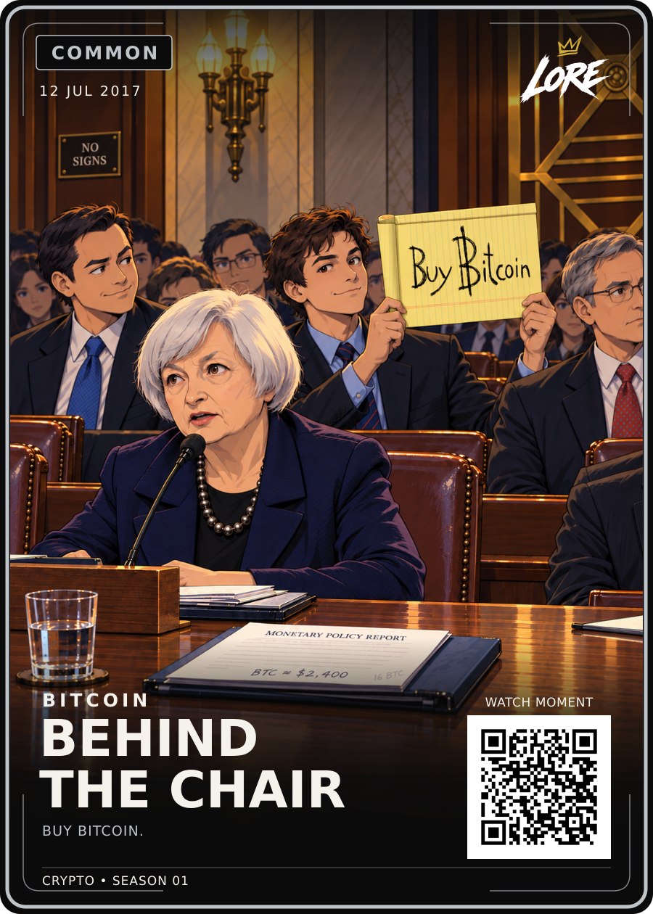

# Behind the Chair — Common / approved v1

**12 JUL 2017 · BITCOIN · BUY BITCOIN.**

[PNG](LORE-Behind-The-Chair-Common-v1.png) · [SVG](LORE-Behind-The-Chair-Common-v1.svg) · [Artwork](art.png) · [Editable source](LORE-Behind-The-Chair-Common-Review-v2-Source.zip) · [Approval](approval.json) · [Sources](source-notes.md)

Dan approved the exact displayed Common Review-v2: “locked in! uplodat to github”. The wider view, lowered NO SIGNS, handwriting matched to the user attachment, visible desk clues and BEHIND THE CHAIR title are included. All visual files and the source ZIP preserve the approved bytes. Canonical filenames use approved v1.

The source ZIP contains the original review snapshot, editable SVG, illustration, prompt, references, fonts, pinned Common template and rebuild script. Its earlier review-only labels are superseded by approval.json. No regeneration or layout alteration was performed for this upload.

The event is Christian Langalis's yellow Buy Bitcoin sign behind Janet Yellen. NO SIGNS is an invented visual joke; 16 BTC deliberately references the sign's 2024 sale; BTC approximately $2,400 recalls the contemporary price. The desk notes are illustrative props, not Yellen's documented notes.

QR remains a placeholder. Visual master 900 × 1260, eventual trim 63 × 88 mm. No print release or website deployment. HODL and Birth of Doge remain mandatory references for future art.

## Printer-ready front derivative — LORE-CRYPTO-PRINT-v1.0

[Print PNG](LORE-Behind-The-Chair-Common-v1-Print-v1.png) · [Print SVG](LORE-Behind-The-Chair-Common-v1-Print-v1.svg) · [Print manifest](print-v1-manifest.json)

Printer canvas **816 × 1110 px @ 300 DPI**; cut **744 × 1038 px**; safe **684 × 981 px**. Uniform transform `translate(46.515 48.921) scale(0.8033)`. The approved artwork, wording, rarity and QR vector are preserved; the crypto phrase uses the approved **25 / 700** treatment with its existing position, tracking and rarity colour. QR remains **DEMO_ONLY**. Physical proof, physical QR scan and print release remain separate gates.
