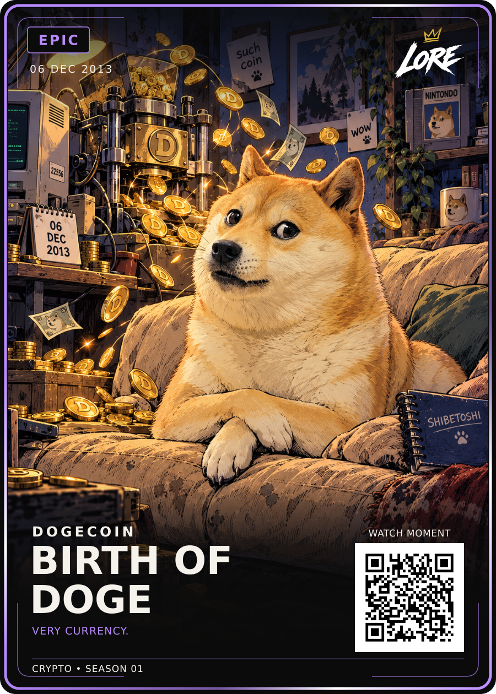

# Birth of Doge — Epic

**06 DEC 2013 · DOGECOIN · CRYPTO • SEASON 01**

[PNG](LORE-Birth-of-Doge-Epic-v1.png) · [Editable SVG](LORE-Birth-of-Doge-Epic-v1.svg) · [Illustration](art.png) ·
[Approval](approval.json) · [Source notes](source-notes.md) · [Manifest](manifest.json)

Visually approved by Dan Payne on 19 September 2026: “approved, upload and move to next card”.
Exact Review-v1 PNG/SVG and art are preserved byte-for-byte. Keep Kabosu's sideways
glance, crossed paws, runaway coin press, drawing treatment and four Easter eggs.

Phrase: **VERY CURRENCY.**, verified from the launch-era official forum thread.
The 6 December launch date is distinct from that thread's 8 December posting date.
Existing LORE-FRONT-v4 geometry/fonts, shared back v5 and 63 × 88 mm trim apply.
One Epic rarity, with standard and foil finishes planned. QR remains demo-only.
Website publication and physical print release are separate.
