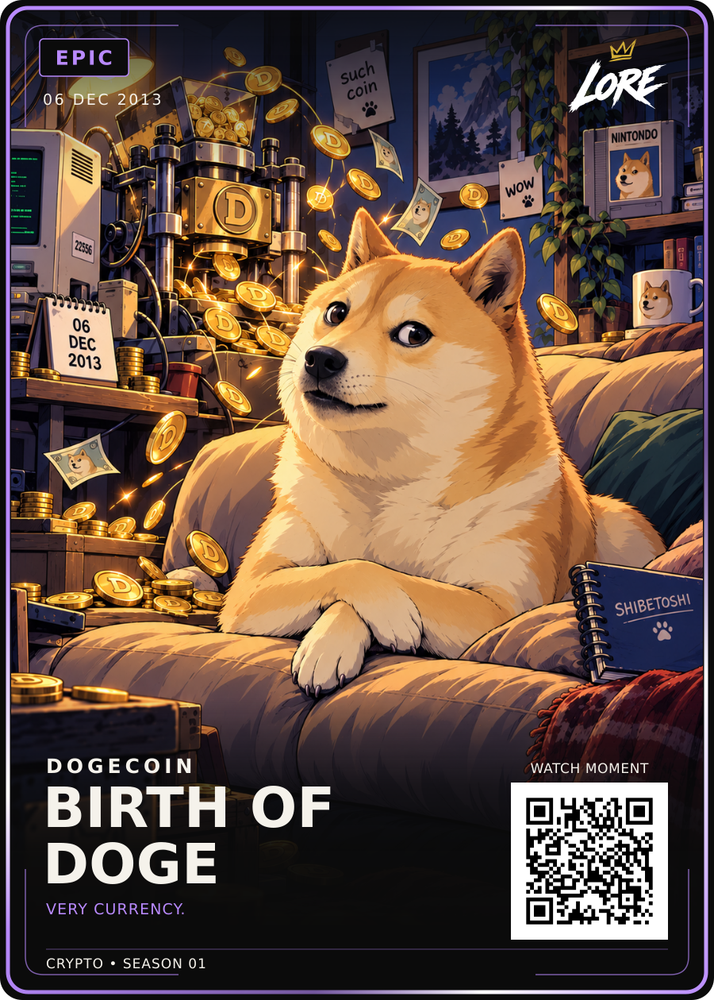

# Birth of Doge — Epic / approved HODL-style revision

**06 DEC 2013 · DOGECOIN · VERY CURRENCY.**

[PNG](LORE-Birth-of-Doge-Epic-v2.png) · [SVG](LORE-Birth-of-Doge-Epic-v2.svg) · [Art](art.png) ·
[Approval](approval.json) · [Sources](source-notes.md) · [Manifest](manifest.json)

Dan selected the exact Style-Review-v1 on 20 September 2026: “Approved!”.
These are byte-for-byte copies of the reviewed PNG, SVG and artwork. The entire
scene uses the permanent [HODL reference](../../ART-STYLE.md), supplied directly
alongside the previous Doge art during generation. HODL remains the style master.

Kabosu's expression, crossed paws and fictional coin-mint scene are preserved.
The four clue props remain: NINTONDO cartridge, SHIBETOSHI notebook, 22556
computer label and 06 DEC 2013 calendar. Their source basis is recorded separately.
Only the embedded illustration changed from the previous approved Epic SVG;
fixed geometry, typography, logo, date, footer and QR are unchanged.
The previous approved visual remains archived in ../birth-of-doge-master-01.

All four previously approved crypto cards now have approved HODL-style versions.
First Transfer remains an unapproved draft. Demo QR; no site or print release.

## Printer-ready front derivative — LORE-CRYPTO-PRINT-v1.0

[Print PNG](LORE-Birth-of-Doge-Epic-v2-Print-v1.png) · [Print SVG](LORE-Birth-of-Doge-Epic-v2-Print-v1.svg) · [Print manifest](print-v1-manifest.json)

Printer canvas **816 × 1110 px @ 300 DPI**; cut **744 × 1038 px**; safe **684 × 981 px**. Uniform transform `translate(46.515 48.921) scale(0.8033)`. The approved artwork, wording, rarity and QR vector are preserved; the crypto phrase uses the approved **25 / 700** treatment with its existing position, tracking and rarity colour. QR remains **DEMO_ONLY**. Physical proof, physical QR scan and print release remain separate gates.
