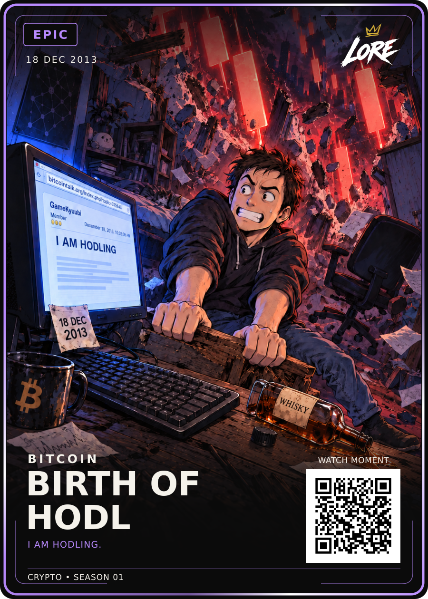

# Birth of HODL — Epic

**18 DEC 2013 · CRYPTO • SEASON 01**

[PNG](LORE-Birth-of-HODL-Epic-v1.png) · [Editable SVG](LORE-Birth-of-HODL-Epic-v1.svg) · [Illustration](art.png) ·
[Approval](approval.json) · [Source notes](source-notes.md) · [Manifest](manifest.json)

Visually approved by Dan Payne on 19 September 2026: “approved upload to github and decide next card”.
Exact Review-v2 PNG/SVG and selected art-v3 are preserved byte-for-byte.
The raised D/L keycaps are removed. Keep the normal keyboard, stubborn expression,
crashing red candles, blue monitor light, whisky and remaining Easter eggs.

Phrase: **I AM HODLING.**, verified against GameKyuubi's original thread title.
Existing LORE-FRONT-v4 geometry and fonts, shared back v5 and 63 × 88 mm trim apply.
One Epic rarity, with standard and foil finishes. QR remains a demo placeholder.
Website publication and physical print release are separate.
