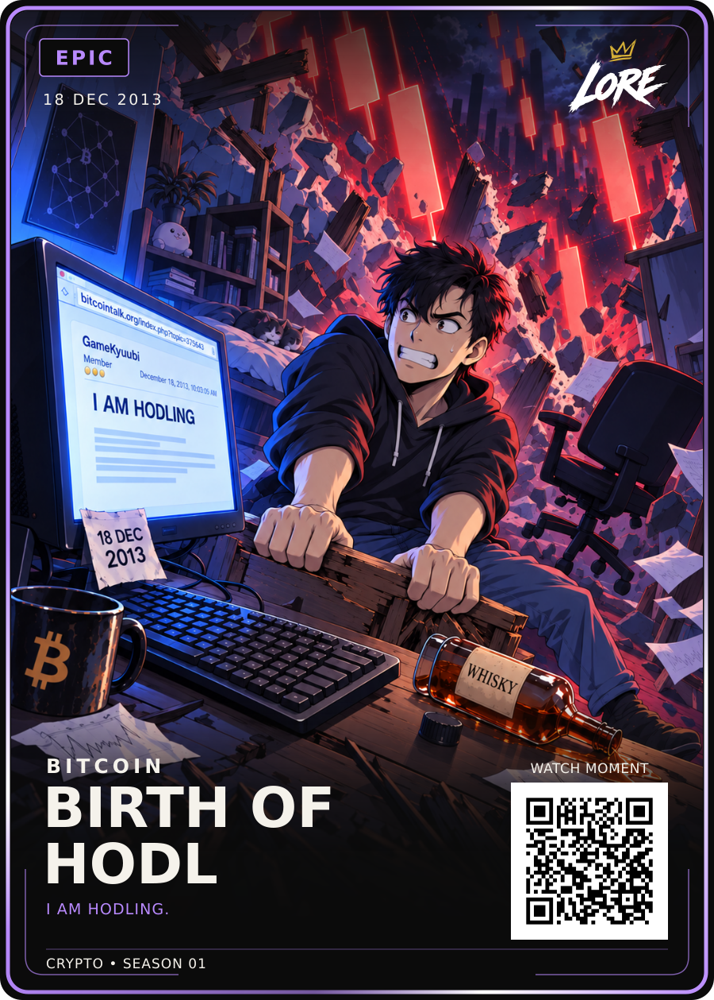

# Birth of HODL — approved crypto style master

**EPIC · 18 DEC 2013 · BITCOIN · I AM HODLING.**

[PNG](LORE-Birth-of-HODL-Epic-v2.png) · [SVG](LORE-Birth-of-HODL-Epic-v2.svg) · [Art](art.png) ·
[Approval](approval.json) · [Source notes](source-notes.md) · [Manifest](manifest.json)

Dan approved this exact background-refined Manhwa Review-v2 on 19 September 2026
and selected it as the permanent art reference for every crypto card.
Read [the crypto style standard](../../ART-STYLE.md) and
[the reference lock](../../style-reference-lock.json).

Crypto and Creator cards are separate products with separate art directions.
Match this entire illustration: character, props, room, rubble and lighting.
Preserve these exact bytes. All restyles and new cards must include this art
directly as the style input; no chain of replacements can silently supersede it.
The original HODL remains archived in ../birth-of-hodl-master-01.

LORE-FRONT-v4, original fonts/brand/QR, shared back v5 and 63 × 88 mm trim retained.
Standard and foil share this artwork. QR is demo-only; print release separate.
