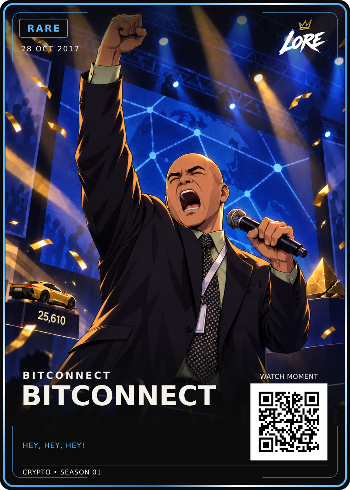

# BitConnect — Rare / approved v1

**28 OCT 2017 · BITCONNECT · HEY, HEY, HEY!**

[PNG](LORE-BitConnect-Rare-v1.png) · [SVG](LORE-BitConnect-Rare-v1.svg) · [Art](art.png) ·
[Editable source package](LORE-BitConnect-Rare-Review-v3-Source.zip) · [Approval](approval.json) · [Sources](source-notes.md)

Dan approved exact Rare Review-v3. These PNG/SVG/art and the source ZIP preserve
the selected bytes. Larger cracked pyramid beside his microphone arm, darker
blue-and-gold lighting and corrected car are retained. BITCONNECT is one word
on the existing first title baseline; the second title field is empty. Font and
all fixed element geometry are unchanged. The opt-in renderer exception is in
the source ZIP only; shared templates and renderer are not changed.

Both HODL v2 and Birth of Doge v2 remain mandatory references. This archive does
not replace them or retrospectively invent generation provenance. The original
generation prompt is labelled historical; later edit instructions are in source notes.

The exact source archive includes editable SVG, data, references, source evidence,
build script, font files, Rare template and renderer. The art layer is raster.
QR is a demo placeholder. Visual approval is separate from print preparation.

## Printer-ready front derivative — LORE-CRYPTO-PRINT-v1.0

[Print PNG](LORE-BitConnect-Rare-v1-Print-v1.png) · [Print SVG](LORE-BitConnect-Rare-v1-Print-v1.svg) · [Print manifest](print-v1-manifest.json)

Printer canvas **816 × 1110 px @ 300 DPI**; cut **744 × 1038 px**; safe **684 × 981 px**. Uniform transform `translate(46.515 48.921) scale(0.8033)`. The approved artwork, wording, rarity and QR vector are preserved; the crypto phrase uses the approved **25 / 700** treatment with its existing position, tracking and rarity colour. QR remains **DEMO_ONLY**. Physical proof, physical QR scan and print release remain separate gates.
