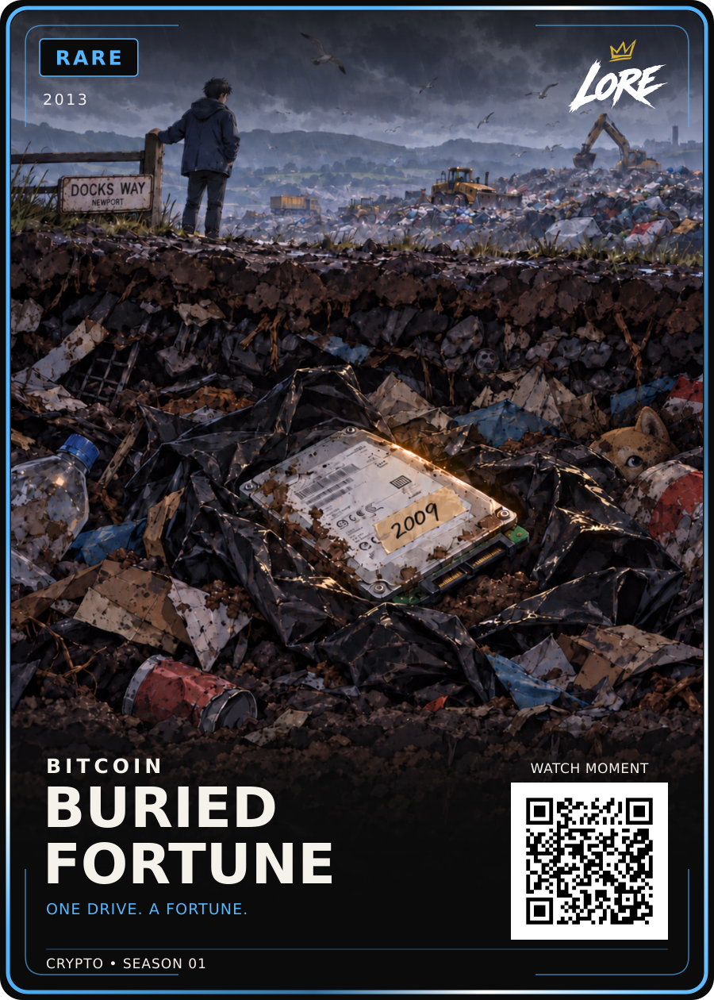

# Buried Fortune — Rare / approved v1

**2013 · BITCOIN · ONE DRIVE. A FORTUNE.**

[PNG](LORE-Buried-Fortune-Rare-v1.png) · [SVG](LORE-Buried-Fortune-Rare-v1.svg) · [Artwork](art.png) · [Editable source](LORE-Buried-Fortune-Rare-Review-v3-Source.zip) · [Approval](approval.json) · [Sources](source-notes.md)

Dan approved the exact displayed Rare Review-v3: “approved, up load to github and move to next card”. The final illustration has no newspaper and a dirty Doge plush mostly hidden behind rubbish. The hard drive, 2009 clue, black bin bag and Docks Way/Newport sign remain. Canonical approved files use v1; their bytes match the selected review exactly.

The original source ZIP is unchanged and contains the editable card, renderer, pinned template and fonts, generation prompt and every image input. Its older review-only labels are superseded by approval.json. Previous art within the ZIP is reference material, not approved alternative artwork.

The landfill cutaway and plush are illustrative. The exact disposal day is uncertain, so the card displays 2013. The 2009 tape references the mining year; it is an invented prop detail. Caption is editorial. The user wants the historical value explained through the eventual QR story, not on the illustration.

QR remains a placeholder. Visual 900 × 1260; eventual trim 63 × 88 mm. No print release or website deployment. HODL and Birth of Doge remain the mandatory style pair.

## Printer-ready front derivative — LORE-CRYPTO-PRINT-v1.0

[Print PNG](LORE-Buried-Fortune-Rare-v1-Print-v1.png) · [Print SVG](LORE-Buried-Fortune-Rare-v1-Print-v1.svg) · [Print manifest](print-v1-manifest.json)

Printer canvas **816 × 1110 px @ 300 DPI**; cut **744 × 1038 px**; safe **684 × 981 px**. Uniform transform `translate(46.515 48.921) scale(0.8033)`. The approved artwork, wording, rarity and QR vector are preserved; the crypto phrase uses the approved **25 / 700** treatment with its existing position, tracking and rarity colour. QR remains **DEMO_ONLY**. Physical proof, physical QR scan and print release remain separate gates.
