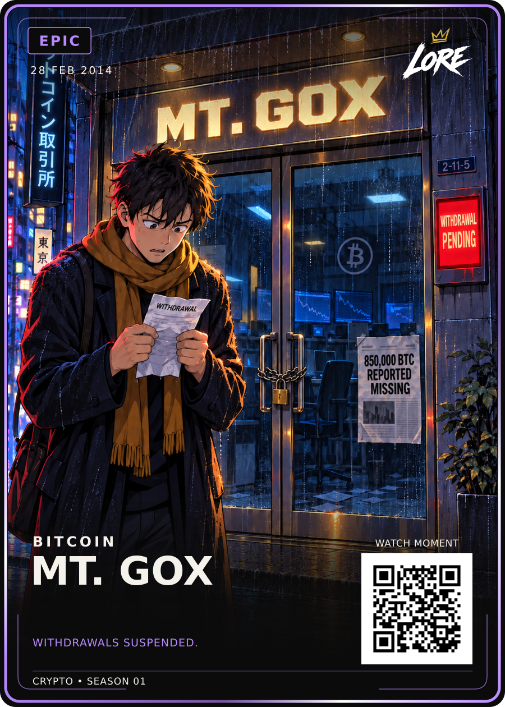

# MT. GOX — Epic / approved v1

**28 FEB 2014 · BITCOIN · WITHDRAWALS SUSPENDED.**

[PNG](LORE-Mt-Gox-Epic-v1.png) · [SVG](LORE-Mt-Gox-Epic-v1.svg) · [Artwork](art.png) ·
[Editable source](LORE-Mt-Gox-Epic-Review-v3-Source.zip) · [Approval](approval.json) · [Sources](source-notes.md)

Dan approved the exact displayed Review-v3: “approved”. The one-line MT. GOX
heading and stronger visible rain are preserved with the customer, chained
glass doors, padlock and three historical clues. All visual files and the source
ZIP are identical to the reviewed bytes. Canonical filenames use approved v1.

The source ZIP contains the complete pre-approval review snapshot, editable SVG,
art, prompts, references, fonts, fixed template and rebuild script. Its earlier
review-status labels are superseded by the sibling approval.json; no visual
regeneration or layout alteration was performed for this upload.

The date marks the civil rehabilitation filing. The newspaper states the initial
850,000 BTC reported missing; about 200,000 were later located. The customer,
building and withdrawal terminal are symbolic. Caption is editorial wording.
MT. GOX uses custom illustrated lettering; visual approval is separate from IP clearance.
QR is a placeholder. Trim is 63 × 88 mm, preview 900 × 1260; no print release.
Both HODL and Birth of Doge remain the mandatory style references.
