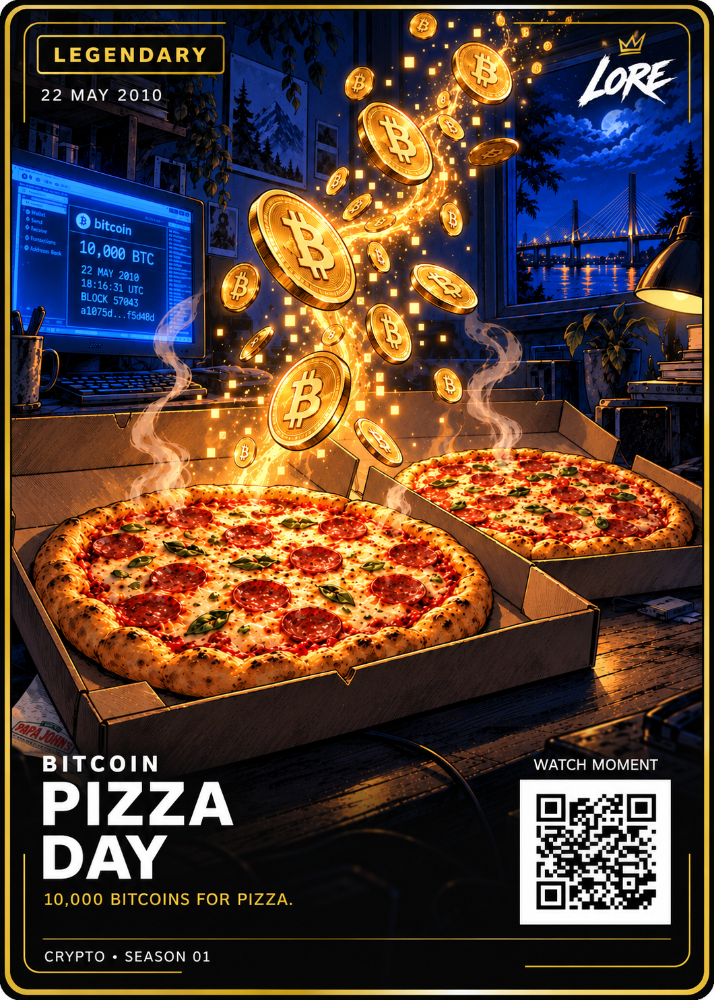

# Bitcoin Pizza Day — Legendary

**22 MAY 2010 · CRYPTO • SEASON 01**

[Exact approved PNG](LORE-Bitcoin-Pizza-Day-Legendary-v1.png) · [Selected illustration](art.png) ·
[Source notes](source-notes.md) · [Approval](approval.json) · [Manifest](manifest.json)

Latest preview visually approved by Dan Payne and authorised for GitHub on
19 September 2026. Exact approved image bytes are preserved, including the
integrated screen, napkin and bridge. Earlier overlay experiments are excluded.

The offer was posted on 18 May; successful exchange was confirmed on 22 May.
The card therefore retains **22 MAY 2010**. Each crypto event has one rarity;
standard and foil are separate finishes. See [collection rules](../../COLLECTION-RULES.md).

This is a 1060 × 1484 raster visual reference, not a verified editable template
or print release. No corresponding SVG is available. QR is the reviewed demo
placeholder. Printing and website publication require separate deliverables.
