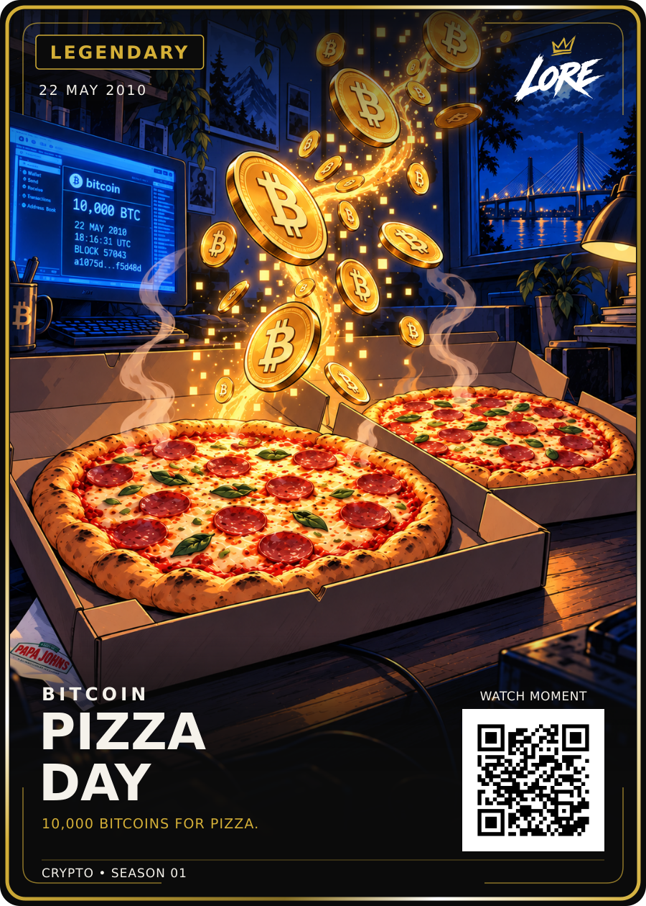

# Pizza Day — Legendary / approved HODL-style revision

**22 MAY 2010 · BITCOIN · 10,000 BITCOINS FOR PIZZA.**

[PNG](LORE-Bitcoin-Pizza-Day-Legendary-v2.png) · [SVG](LORE-Bitcoin-Pizza-Day-Legendary-v2.svg) · [Art](art.png) ·
[Approval](approval.json) · [Sources](source-notes.md) · [Manifest](manifest.json)

Dan selected the exact final Style-Review-v1 on 20 September 2026: “Approved, next :)”.
These are byte-for-byte copies. The entire scene uses the permanent
[HODL reference](../../ART-STYLE.md), which remains the style master.

The pinned Legendary template and 40-unit upward art placement were included
in the reviewed card. Both pizzas, coin spiral, screen clues, bridge and napkin
remain. The earlier raster preview is preserved in ../pizza-day-master-01.

Demo QR; no website deployment or print release. Screen blockchain time is not
pizza delivery time; exact transaction fields still need checking before print.

## Printer-ready front derivative — LORE-CRYPTO-PRINT-v1.0

[Print PNG](LORE-Bitcoin-Pizza-Day-Legendary-v2-Print-v1.png) · [Print SVG](LORE-Bitcoin-Pizza-Day-Legendary-v2-Print-v1.svg) · [Print manifest](print-v1-manifest.json)

Printer canvas **816 × 1110 px @ 300 DPI**; cut **744 × 1038 px**; safe **684 × 981 px**. Uniform transform `translate(46.515 48.921) scale(0.8033)`. The approved artwork, wording, rarity and QR vector are preserved; the crypto phrase uses the approved **25 / 700** treatment with its existing position, tracking and rarity colour. QR remains **DEMO_ONLY**. Physical proof, physical QR scan and print release remain separate gates.
