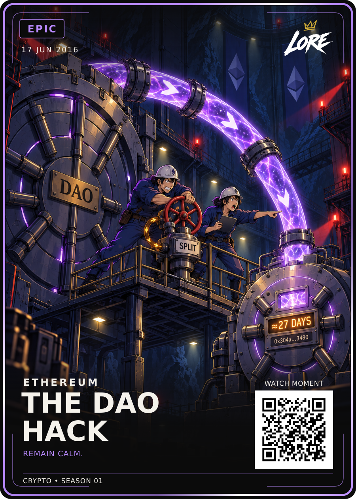

# The DAO Hack — Epic / approved v1

**17 JUN 2016 · ETHEREUM · REMAIN CALM.**

[PNG](LORE-The-DAO-Hack-Epic-v1.png) · [SVG](LORE-The-DAO-Hack-Epic-v1.svg) · [Art](art.png) ·
[Editable source](LORE-The-DAO-Hack-Epic-Review-v2-Source.zip) · [Approval](approval.json) · [Sources](source-notes.md)

Dan approved exact Epic Review-v2. The reviewed PNG/SVG/art and source ZIP are
preserved byte-for-byte. One-way violet drainage, a small amber recursive-call
loop and the larger engineers remain unchanged. All four clues are retained.

The large vault is The DAO. The smaller vault represents the attacker-controlled
child DAO, where the diverted Ether is temporarily locked. SPLIT names the
exploited function, not the later Ethereum chain split. The setting is fictional.

The source ZIP includes raster artwork, editable SVG, data, all direct image
references, generation prompt, source notes, renderer, fonts and Epic template.
Its review-stage status is historical; approval.json records the current approval.
Both HODL and Birth of Doge remain mandatory whole-scene references for new art.
QR is a demo placeholder. Visual approval is separate from print release.

## Printer-ready front derivative — LORE-CRYPTO-PRINT-v1.0

[Print PNG](LORE-The-DAO-Hack-Epic-v1-Print-v1.png) · [Print SVG](LORE-The-DAO-Hack-Epic-v1-Print-v1.svg) · [Print manifest](print-v1-manifest.json)

Printer canvas **816 × 1110 px @ 300 DPI**; cut **744 × 1038 px**; safe **684 × 981 px**. Uniform transform `translate(46.515 48.921) scale(0.8033)`. The approved artwork, wording, rarity and QR vector are preserved; the crypto phrase uses the approved **25 / 700** treatment with its existing position, tracking and rarity colour. QR remains **DEMO_ONLY**. Physical proof, physical QR scan and print release remain separate gates.
