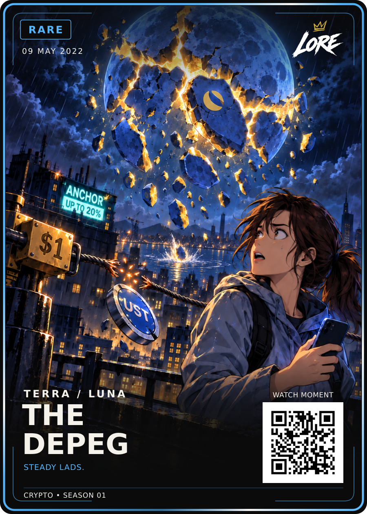

# The Depeg — Rare / approved v1

**09 MAY 2022 · TERRA / LUNA · STEADY LADS.**

[PNG](LORE-The-Depeg-Rare-v1.png) · [SVG](LORE-The-Depeg-Rare-v1.svg) · [Artwork](art.png) ·
[Editable source](LORE-The-Depeg-Rare-v1-Source.zip) · [Approval](approval.json) · [Sources](source-notes.md)

Dan selected the latest artwork and approved final card assembly and GitHub upload.
The two selected lower emblems are removed, the upper emblem is retained, the
broken cable continues behind the woman, and a moon-rock splash hits the harbour.
Faint LUNA lettering was removed again to complete his earlier instruction.
The ANCHOR / UP TO 20% sign and UST/$1 symbolism remain unchanged.

The broken cable represents UST losing its intended dollar peg. The shattered
moon symbolises LUNA's collapse. The date marks the reassurance post during the
multi-day crisis. The scene and observer are fictional visual metaphors.

The self-contained ZIP contains editable SVG, art, data, prompts, both mandatory
style references, exact fonts/template, build script and source records.
No fixed layout geometry changed. QR remains a placeholder; print release is separate.
Both HODL and Birth of Doge remain the permanent required style references.
