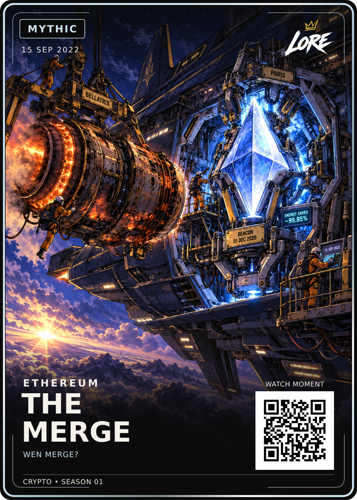

# The Merge — Mythic

**15 SEP 2022 · ETHEREUM · CRYPTO • SEASON 01**

[PNG](LORE-The-Merge-Mythic-v1.png) · [Editable SVG](LORE-The-Merge-Mythic-v1.svg) · [Illustration](art.png) ·
[Approval](approval.json) · [Source notes](source-notes.md) · [Manifest](manifest.json)

Visually approved by Dan Payne on 19 September 2026: “approved, upload and move onto the next card”.
Exact Review-v1 PNG/SVG and art are preserved byte-for-byte. Keep the engine swap,
orange/blue lighting and four groups of source-backed Easter eggs unchanged.

Phrase: **WEN MERGE?**, verified in Ethereum's official pre-event announcement.
LORE-FRONT-v4 geometry and fonts, shared back v5 and 63 × 88 mm trim apply.
One Mythic rarity, standard and foil finishes planned. QR remains a demo placeholder.
Website publication, manufacturing foil artwork and print release are separate.
