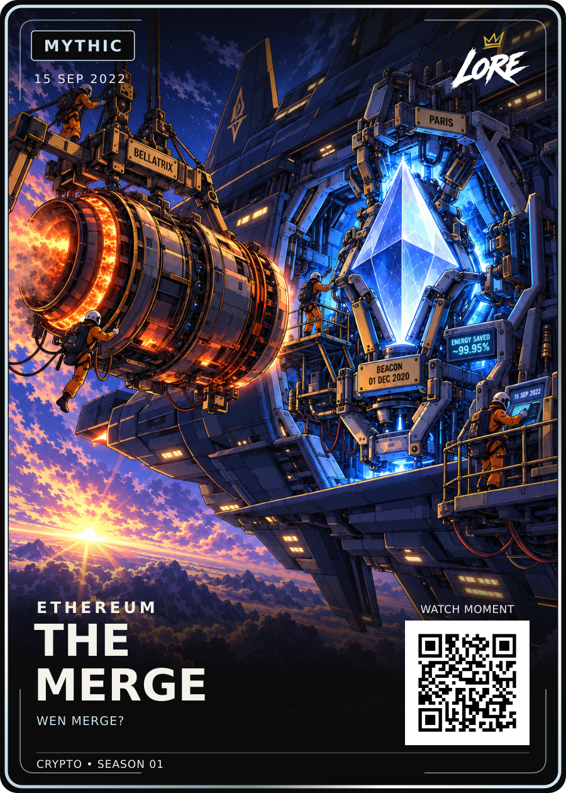

# The Merge — Mythic / approved HODL-style revision

**15 SEP 2022 · ETHEREUM · WEN MERGE?**

[PNG](LORE-The-Merge-Mythic-v2.png) · [SVG](LORE-The-Merge-Mythic-v2.svg) · [Art](art.png) ·
[Approval](approval.json) · [Sources](source-notes.md) · [Manifest](manifest.json)

Dan selected the exact Style-Review-v1 on 20 September 2026: “All approved, now birth of hodl”.
These are byte-for-byte copies of the reviewed PNG, SVG and artwork. The entire
scene uses the permanent [HODL reference](../../ART-STYLE.md), supplied directly
alongside the previous Merge art during generation. HODL remains the style master.

Only the embedded art changed from the prior approved Merge SVG. Layout, logo,
badge, copy, date, footer and QR remain exact. All four environmental clue groups
are retained: BELLATRIX/PARIS, BEACON/01 DEC 2020, ENERGY SAVED/~99.95%, and
the 15 SEP 2022 console date. The spacecraft is a fictional visual interpretation
of the engine-swap analogy. Previous art remains in ../the-merge-master-01.

Demo QR; no website deployment or print release.
