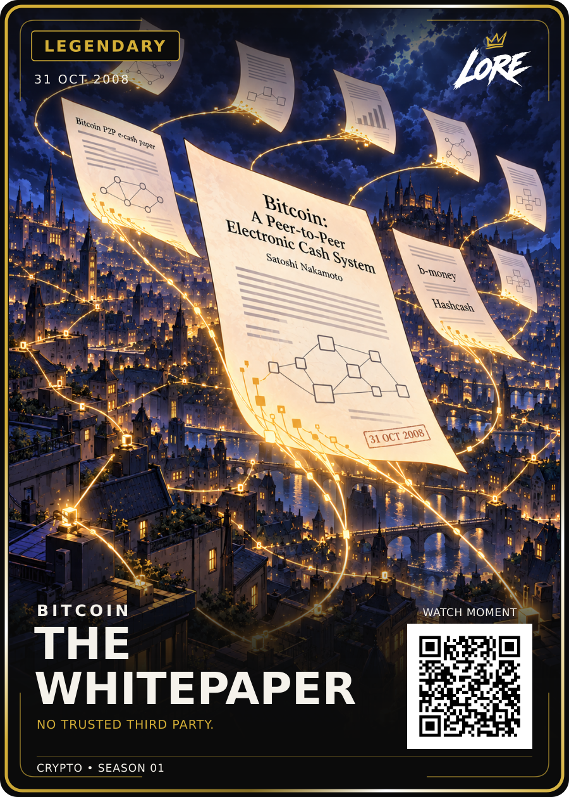

# The Whitepaper — Legendary / approved v1

**31 OCT 2008 · BITCOIN · NO TRUSTED THIRD PARTY.**

[PNG](LORE-The-Whitepaper-Legendary-v1.png) · [SVG](LORE-The-Whitepaper-Legendary-v1.svg) · [Art](art.png) ·
[Approval](approval.json) · [Sources](source-notes.md) · [Manifest](manifest.json)

Dan approved the exact Review-v1 on 20 September 2026. These PNG, SVG and art
files preserve the reviewed bytes without regeneration or layout changes.
Both pinned HODL v2 and Birth of Doge v2 artworks were inspected and supplied
directly during generation under LORE-CRYPTO-STYLE-v1.1. Neither is replaced by
this card's approval.

Nine illuminated sheets become network connections above an invented city.
The source-backed clues are the nine-page count, announcement date, mailing-list
subject and b-money/Hashcash references. Other marks are decorative; this is
not a reconstruction of Satoshi's identity or location. See source-notes.md.

The pinned Legendary template, fonts, renderer, artwork embedding, actual demo
QR and 900 × 1260 dimensions were verified in review. Exact bytes, dimensions
and embedded artwork were rechecked for archival. Five crypto cards are approved.
The editable review source package remains available with the original review.
Demo QR; physical trim 63 × 88 mm; print release remains separate.
