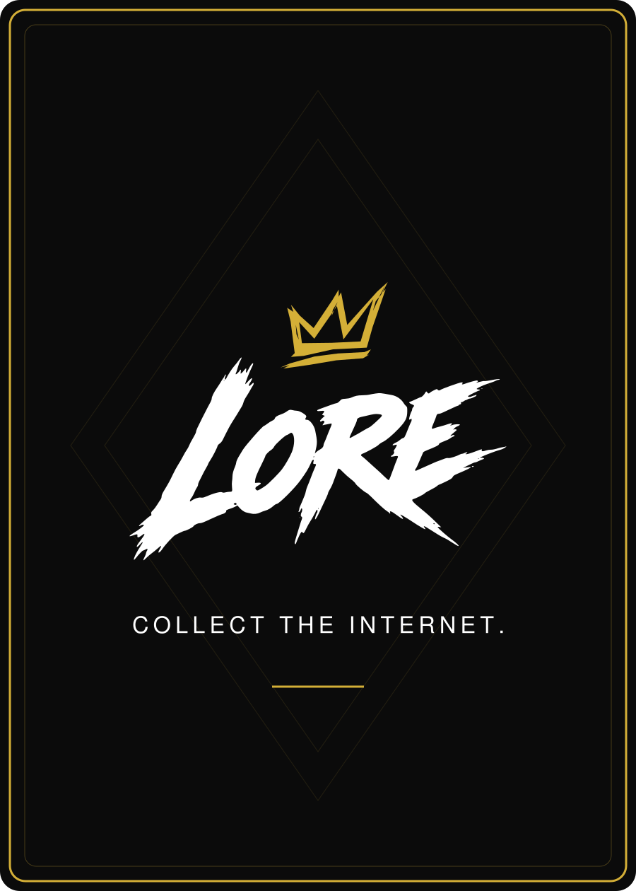

# Shared LORE back — proposal v3

**Status: BACK_REVIEW_PENDING.** Front endorsement does not approve this back.

One common design is proposed for all creators and rarities: Obsidian background, exact white LORE wordmark with the approved gold crown, the master tagline, a thin gold border and very subtle geometric detail. Card-specific stories and sources would live on the moment page reached from the front QR.

The [SVG](LORE-Shared-Back-v3.svg) uses vector elements and the exact approved brand assets. Flat RGB gold is shown; this is not a foil or print proof. No creator name, rarity, personal story or card-specific QR is included on this proposed shared back.

Daniel has asked to review the back before locking the complete card system. Keep this status until he approves a specific back revision.
